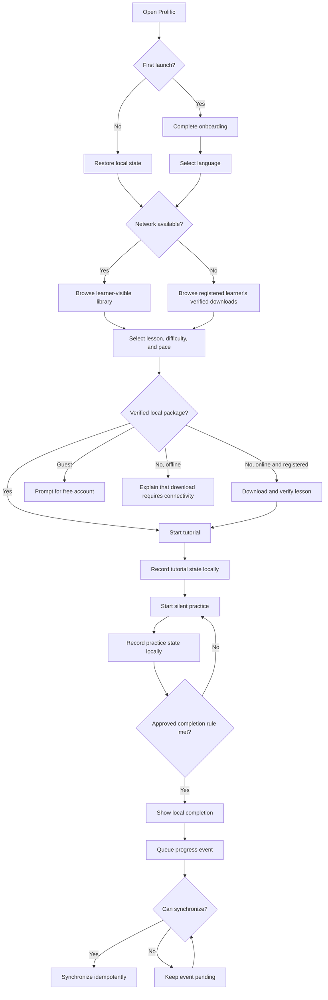
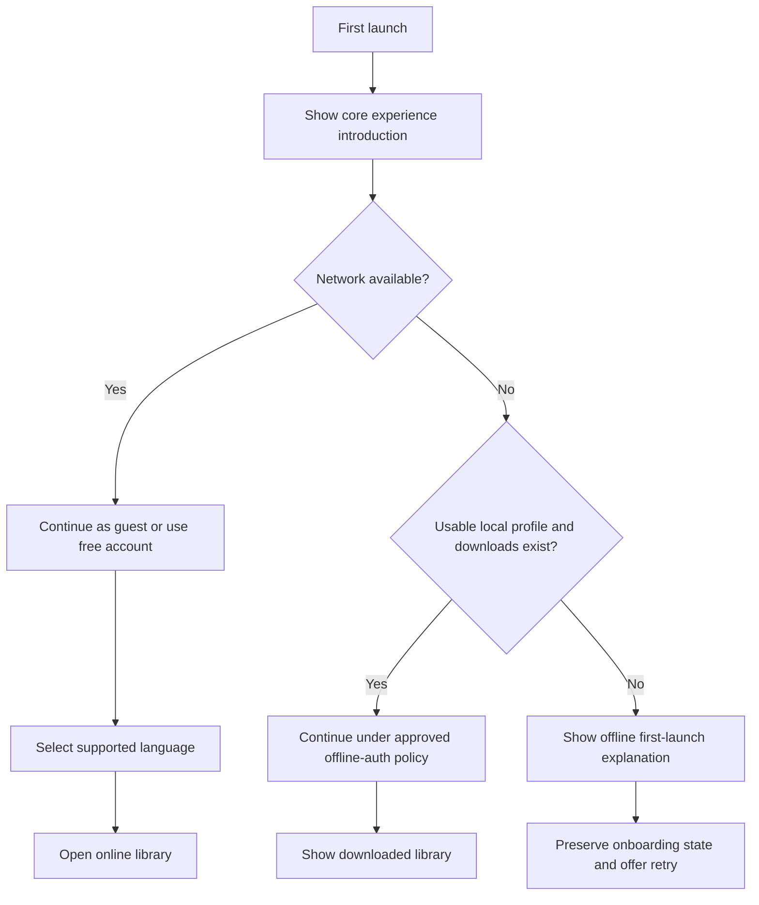
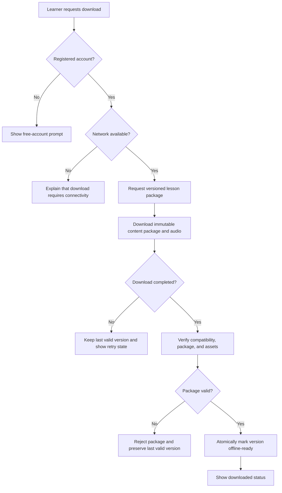
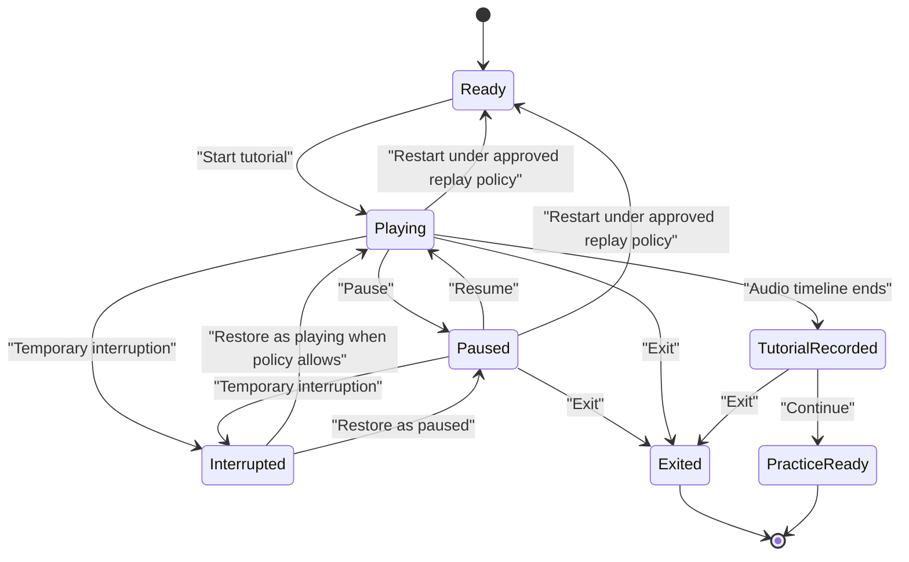
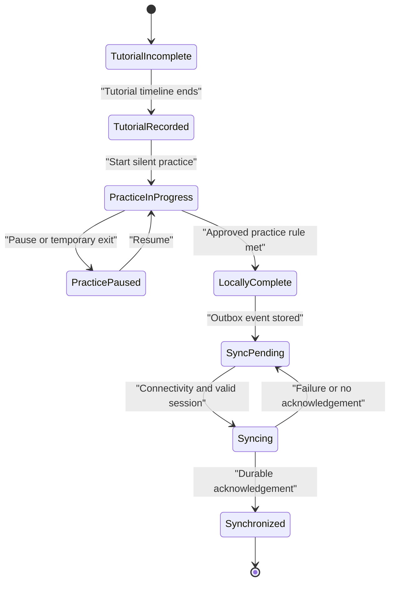
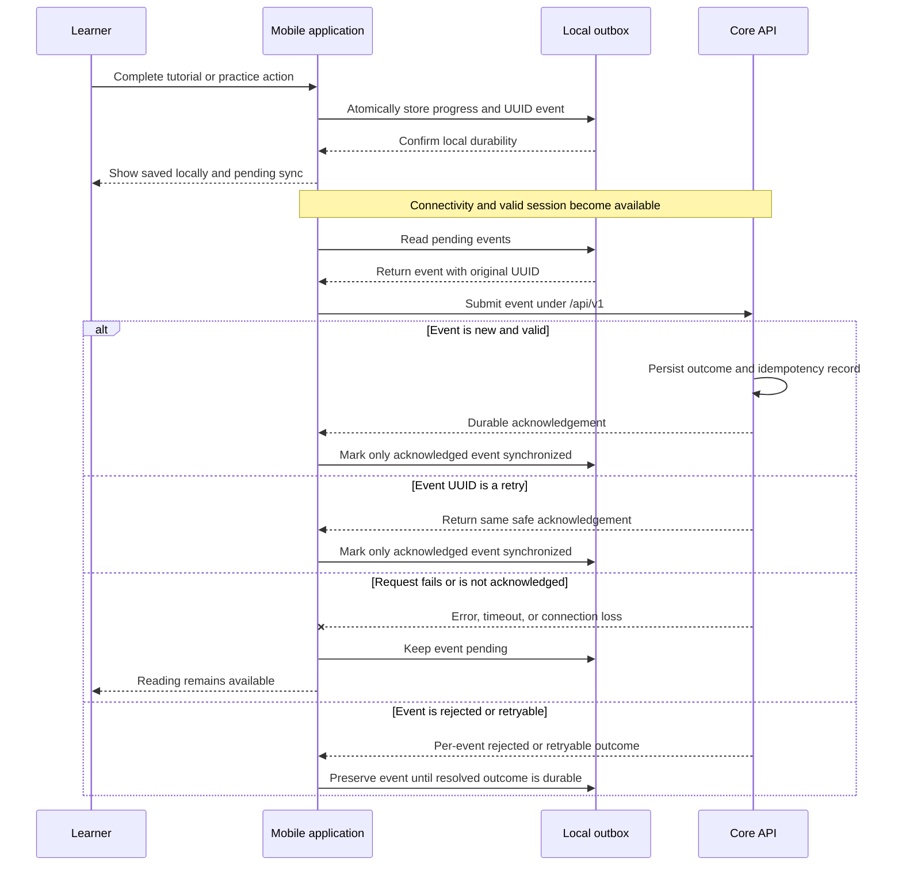

# Prolific MVP User Flows

## Purpose

This document defines the learner-facing flows required for the Prolific MVP. It describes user intent, system responses, offline branches, failure recovery, and completion outcomes without prescribing screen layouts or implementation details.

The flows are based on `AGENTS.md` and `docs/02-requirements/mvp-scope.md`. Where those documents leave policy unresolved, this document names the dependency instead of inventing a decision.

## Experience Principles

All MVP flows must follow these principles:

- **Mobile first:** Every core learner journey is designed for a supported mobile device.
- **Optional account:** A guest can try the core reading journey; a free account unlocks the complete library, downloads, durable progress, synchronization, history, and streaks.
- **Offline first:** The application opens without a network connection, and a registered learner's verified downloaded lessons remain readable.
- **Local first:** Reading progress is saved locally before synchronization is attempted.
- **Clear state:** The learner can distinguish downloaded, downloading, unavailable, unsynced, syncing, synchronized, and failed states.
- **Safe recovery:** Failed downloads and synchronization attempts do not destroy the last valid lesson package or unsynced progress.
- **Controlled content:** Only content that has passed the required review and learner-visibility controls appears in the learner library.
- **Separate learning modes:** Tutorial listening and silent practice are distinct states; tutorial playback alone never completes a lesson.
- **Accessible control:** Essential actions and statuses must not depend only on color, animation, sound, or gesture.

## Core Journey Overview

## 1. First-Time Onboarding

### Goal

Help a new learner understand the tutorial-and-practice journey, continue as a guest or optionally create a free account, select an initial launch language, and reach useful content without implying that internet access is always available.

### Entry conditions

- The application has no completed-onboarding marker for the current local installation or approved learner profile.
- The application may be online or offline.

### Main flow

1. The learner opens Prolific for the first time.
2. The application presents a concise introduction to the core experience:
   - listen in tutorial mode and replay it when wanted;
   - practise silently at a selected pace;
   - download lessons for offline reading; and
   - keep progress locally until it can synchronize.
3. The learner may continue as a guest or register/sign in for account-only capabilities.
4. The learner selects English, isiZulu, or Sepedi when eligible content is available.
5. The application records onboarding completion locally.
6. The learner continues to the appropriate library:
   - the online learner-visible library when connected; or
   - the downloaded library when valid local content exists.

### Offline and exception branches

- A genuine first launch without a local profile or downloaded content cannot fabricate an online catalog. It must explain what requires connectivity and allow the learner to retry.
- Authentication failure must not delete a previously established local profile, valid downloads, or unsynced progress.
- Credential/provider details, recovery, consent, learner age, guardian involvement, exact deletion timing/retention, and offline authentication remain policy work; the history-safe boundary follows ADR-017.
- A guest requesting an account-only capability is shown: "Create a free account to save your progress and unlock offline reading."

### Exit conditions

- Onboarding completion is stored locally.
- An initial language has been selected when supported content is available.
- The learner reaches an online library, a downloaded library, or an actionable offline first-launch state.

## 2. Language Selection

### Goal

Let the learner choose the language used to filter available lessons without losing downloads or progress from another language.

### Entry points

- First-time onboarding.
- The library's language-selection control.
- Any later approved learner-preference entry point.

### Main flow

1. The application shows the launch languages available in the current context—English, isiZulu, and Sepedi—filtered to:
   - learner-visible server content when online; and
   - languages represented by verified local downloads when offline.
2. The learner selects a language.
3. The application stores the preference locally.
4. The library refreshes to show content for the selected language.
5. The application preserves downloads, progress, and unsynced events associated with other languages.

### Alternate and failure states

- If the selected language has no eligible online lessons, the application shows an empty state without substituting lessons from another language.
- If the selected language has no verified downloads while offline, the application explains that no offline lessons are available in that language and allows another language to be selected.
- A server refresh failure preserves the last valid local selection and cached information; it does not present stale content as newly verified server availability.

### Exit conditions

- The selected language is locally persisted.
- The library clearly reflects the selected language and current connectivity context.

## 3. Library Browsing

### Goal

Help the learner find an eligible lesson by language, topic, and difficulty and understand whether it is available offline.

### Main flow

1. The learner opens the library.
2. The application determines the current connectivity state.
3. When online, the application requests the catalog allowed by access state: Categories/Topics with Effective Visibility and limited published free lessons for guests, or the eligible complete published library for registered learners.
4. When offline, the application reads the verified downloaded-lesson index.
5. The learner selects a Category, follows zero or more nested Topic levels, and selects a Lesson. The launch UI normally presents no more than three visible taxonomy levels, but traversal does not assume a fixed maximum hierarchy depth.
6. The learner selects or confirms difficulty and easy (100 WPM), medium (150 WPM), or hard (200 WPM).
7. The application shows relevant lesson metadata, including download state.
8. The learner chooses to download the lesson, open an existing verified download, or return to the library.

### Content visibility rules

- Only eligible published content appears. Draft, in-review, approved-only, withdrawn, and archived content must never appear. Internal review terminology, notes, and actor details are not shown to learners.
- A guest sees only the designated limited free selection; registration unlocks the complete eligible library.
- Pagination must not create duplicate visible entries as additional pages load.
- If server content changes during browsing, the application must not silently switch the selected Lesson Revision after the learner has opened its details.

### Empty and error states

- No eligible lessons for the chosen language or topic.
- A Category or ancestor Topic becomes hidden or archived while browsing; refresh returns to the nearest still-eligible level without exposing internal state.
- No verified downloads while offline.
- Catalog request failed, with a retry action that does not block access to downloads.
- Lesson metadata is available but its package is incomplete, outdated, or corrupted.

### Exit conditions

- A specific lesson, difficulty, and pace are selected; or
- the learner leaves the library without changing existing downloads or progress.

## 4. Lesson Download

### Goal

Create a complete, verified local lesson package without replacing a valid version with a partial or corrupted download.

### Main flow

### Required package contents

- Exact Lesson, Lesson Variant, Lesson Revision, Revision Number, Language, and Difficulty identity.
- Package Schema Version, supported ordered Content Blocks, Canonical Display Text, Reading Units/Positions and spans, word count, and pace metadata.
- Tokenization and Alignment Profile names/versions.
- Tutorial-audio metadata, local asset, Asset Checksum, and Reading Position alignment entries.
- Learner-visible source attribution, Package Checksum, and interpretation-affecting compatibility data.

The package excludes learner progress/sessions, preferences, analytics, device state, credentials, secrets, temporary transport URLs, local paths, and cache/generation timestamps. See the [Offline Lesson Package](../05-mobile-app/offline-lesson-package.md).

### Interruption and retry behaviour

- Cancellation, network loss, storage failure, unsupported required semantics, missing files, and Package/Asset Checksum failure leave the new package unavailable.
- An unsuccessful update never replaces the last valid local Lesson Revision.
- Retry starts or resumes according to the later download architecture, but the visible outcome must remain deterministic: only a verified package is marked ready.
- If device storage is insufficient, the application explains the issue without deleting other downloads automatically unless an approved storage-management flow explicitly permits it.

### Exit conditions

- The selected Lesson Revision is verified and available offline; or
- the learner receives a recoverable failure state and any previous valid version remains intact.

## 5. Tutorial Playback

### Goal

Guide the learner through one default narrated reading while keeping audio, highlighting, automatic movement, and session state coherent.

### Entry conditions

- The lesson package is complete, version-consistent, and verified.
- A difficulty and pace preset have been selected.

### Main flow

1. The learner opens the lesson and starts tutorial mode.
2. The application loads local tutorial audio, matching Content Blocks, Reading Positions, and Alignment Profile data.
3. Audio begins and the corresponding Reading Position is highlighted.
4. Text moves smoothly to keep the current reading position visible.
5. The learner may pause, resume, adjust font size, restart, or exit.
6. A supported temporary interruption preserves enough state to restore a coherent lesson, mode, logical position, and playback state.
7. Tutorial progress is stored locally.
8. At the end of the tutorial, the application offers the transition to silent practice.

### Player state model

### Rules and unresolved dependencies

- Tutorial playback uses local audio even when the device is online.
- Audio ending records tutorial state but does not complete the lesson.
- The tutorial plays once by default, and learner-initiated replay is allowed. Replay never becomes practice or lesson completion.
- Tutorial and practice share the package's zero-based Reading Positions, but practice does not depend on audio.
- Exact alignment generation, interruption limits, language-specific timing, and acceptable timing drift require approval before implementation.
- Font-size changes must preserve the logical reading position even if line wrapping changes.

### Exit conditions

- Tutorial state is stored locally and the learner can begin silent practice; or
- an interrupted or exited tutorial remains recoverable according to the approved session policy.

## 6. Silent Practice

### Goal

Let the learner practise reading independently while highlighting and automatic movement follow the selected pace without tutorial audio.

### Main flow

1. The learner starts silent practice after the tutorial or from another entry point permitted by the approved session policy.
2. The application confirms practice mode and keeps tutorial audio stopped.
3. Highlighting and automatic movement begin at the selected pace.
4. The learner may play, pause, restart, adjust font size, or exit.
5. The application records practice state locally throughout the session at safe persistence points.
6. Completion is recorded only after practice starts, reaches the final eligible Reading Position, and is not abandoned or exited before that end. A registered learner receives durable local progress and an outbox event; guest progress remains temporary to the current session.

### Alternate and interruption states

- A temporary interruption restores silent mode; it must not start tutorial audio.
- Restart returns to the approved practice start position and creates or updates session state according to the approved completion model.
- Exiting before completion preserves progress without falsely marking the lesson complete.
- Changing font size or device layout preserves the logical Reading Position; display relayout never changes Revision positions.

### Exit conditions

- Practice completion is recorded locally; or
- incomplete practice progress is stored for a supported resume or retry flow.

Interruption/background tolerance, restoration detail, repeated-attempt presentation, and timing edge cases remain release-blocking requirements.

## 7. Lesson Completion

### Goal

Recognize a completed learner practice session locally, communicate synchronization state honestly, and avoid treating tutorial listening as reading completion.

### Main flow

1. Silent practice has started, reaches the final eligible Reading Position, and is not abandoned or exited before that end.
2. The application writes completion locally before displaying it as saved.
3. In the same failure-safe local operation, the application creates an outbox event with a stable UUID and the relevant learner, exact Lesson Revision/profile/schema/Reading Position, mode, and session context.
4. For a registered learner, the application shows completion as stored on the device and updates lessons completed, reading time, words read, recent sessions, and the current/longest daily streak as applicable. Guest completion remains temporary to the current session.
5. If synchronization is currently possible, the application may attempt it without blocking the completion experience.
6. The interface distinguishes local completion awaiting synchronization from server-acknowledged completion.
7. The learner may return to the library or choose another eligible lesson.

### Completion state model

### Rules

- Tutorial completion alone never enters `LocallyComplete`.
- The application must not claim server synchronization before durable acknowledgement.
- A failed synchronization attempt does not reverse local completion or delete its event.
- A streak day requires at least one completed practice session on the learner's local calendar day. Events are stored in UTC; timezone-change and travel handling remain unresolved.
- Interruption/background thresholds, repeated-attempt presentation, and overall lesson-status aggregation remain unresolved.

## 8. Offline Reading

### Goal

Allow a registered learner to open Prolific, find a verified downloaded lesson, complete supported tutorial and practice activities, and save progress without connectivity.

### Main flow

1. A registered learner opens the application without a network connection.
2. The application restores local state under the approved offline-authentication policy.
3. The application shows the downloaded library and an accurate offline status.
4. The learner selects a verified downloaded lesson, difficulty, and pace.
5. The learner uses tutorial mode and silent practice from the local package.
6. The application persists progress locally and writes synchronization events to the outbox.
7. The application shows that progress is saved locally and awaiting synchronization.
8. The learner may close and reopen the application without losing the lesson or unsynced progress.

### Offline capability boundary

These capabilities apply to registered learners with verified downloads. Guests cannot download lessons or retain durable offline progress.

| Available offline                  | Requires connectivity                     |
| ---------------------------------- | ----------------------------------------- |
| Open the application               | Discover new server content               |
| Browse verified downloaded lessons | Download a new lesson                     |
| Play local tutorial audio          | Receive lesson updates                    |
| Use silent practice                | Confirm server synchronization            |
| Change pace or font size           | Complete server-required account changes  |
| Record local progress              | Recover an account through a server flow  |
| Queue synchronization events       | Validate current server publication state |

### Failure states

- If no verified downloads exist, show an offline empty state and explain that lessons must be downloaded while connected.
- If a local package is incomplete or corrupted, do not open it as a valid lesson; preserve its diagnostic state for recovery when online.
- Expired authentication must not silently erase valid downloads or unsynced progress. Continued access depends on the approved offline-authentication policy.
- A Lesson Revision, Package Schema/profile, or checksum mismatch detected locally must prevent mixed content, positions, alignment, and audio from being used in one session.

### Exit conditions

- Progress is safely stored locally with any required outbox events; or
- the learner receives a truthful offline limitation or recoverable package error.

## 9. Delayed Synchronization

### Goal

Deliver locally stored progress after connectivity returns without duplicate sessions, silent data loss, or disruption to reading.

### Trigger conditions

Synchronization may be attempted when:

- one or more unsynced events exist;
- network connectivity is available; and
- the application has or can obtain a valid authenticated session.

The exact background, foreground, manual, and operating-system scheduling triggers belong in the mobile architecture. Regardless of trigger, synchronization must not block offline reading.

### Main flow

### Retry and acknowledgement rules

1. Every retry uses the event's original UUID.
2. The server processes a repeated event ID idempotently and does not create a duplicate session or progress outcome.
3. The client treats only a durable acknowledgement as permission to mark an event synchronized or remove it.
4. A timeout, transport failure, rejected authentication, application termination, or unacknowledged response leaves the event pending.
5. Retries use bounded backoff and do not interrupt the learner's reading flow.
6. Events may be handled in batches only if each event receives `accepted`, `duplicate`, `rejected`, or `retryable`, partial success is supported, and preservation rules remain clear.
7. The interface communicates actionable failures without repeatedly alarming the learner for ordinary temporary disconnection.

### Conflict branches requiring approved policy

- The Lesson Revision referenced by an event is no longer the Variant's Current Published Revision but remains the exact historical reference.
- Separate devices submit progress for the same learner and lesson.
- Events arrive out of order.
- The authenticated session expires while events remain pending.
- An event is structurally invalid or permanently rejected.
- The server accepted an event but the acknowledgement was lost.

No conflict branch may silently discard local progress. The sync contract must define whether the client retries, preserves the event for intervention, accepts a server reconciliation, or records both outcomes.

### Exit conditions

- Every durably acknowledged event is marked synchronized exactly once; and
- every failed, unacknowledged, or unresolved event remains safely pending with enough context for a later retry or documented resolution.

## Cross-Flow Status Language

The final design system should use concise, accessible learner-facing wording for these distinct states:

| System state         | Meaning that must be conveyed                                       |
| -------------------- | ------------------------------------------------------------------- |
| Available online     | Lesson can be viewed but is not necessarily downloaded.             |
| Downloading          | Package transfer or verification is in progress.                    |
| Downloaded           | A complete verified package is available offline.                   |
| Download failed      | The requested package is not ready; retry is possible.              |
| Update not supported | This application version cannot safely use the downloaded package.  |
| Saved on this device | Progress is durable locally.                                        |
| Waiting to sync      | A local event has not received server acknowledgement.              |
| Syncing              | A synchronization attempt is in progress.                           |
| Synchronized         | The server durably acknowledged the event.                          |
| Sync needs attention | A non-transient or policy conflict requires a documented next step. |

Exact labels, translations, icons, and visual treatments belong in the design system. Status must never be communicated by color alone.

## Conceptual account-deletion flow

1. The authenticated learner requests deletion and completes the approved identity-verification step.
2. The application explains early deactivation, session/Device revocation, and pending local event/download assessment; this is not immediate historical cascade deletion.
3. The server reports requested, pending, blocked, completed, or failed status using safe messaging.
4. After deactivation, new sync is rejected and an old Device cannot recreate the account or reattach retained anonymized activity.
5. The application follows approved outbox/download cleanup policy and warns before unavoidable local loss where possible.
6. On completion, profile/progress/history access ends; public content and immutable Revision history remain independent.

Detailed screens, cancellation, verification, timing, legal wording, and device cleanup require privacy/design approval.

## Open UX Dependencies

The following must be resolved in requirements, design, architecture documents, or ADRs before the affected flows are implemented:

- Launch learner ages, operating systems, and minimum device versions.
- Registration credentials/provider, recovery, consent, deletion-completion UX, exact retention/anonymization policy, and offline authentication.
- Language-specific pace adjustments.
- Tutorial/practice interruption, background, restoration, repeated-attempt, and timing edge cases.
- Timezone-change and travel handling for local-calendar streaks.
- Exact audio-alignment generation/format and acceptable playback/highlight drift; the shared Reading Position boundary is approved.
- Language-specific Tokenization Profile details, Package Schema compatibility window, and unsupported-package recovery wording.
- Download update, deletion, storage-limit, and corrupted-package recovery policy.
- Synchronization ordering, batching, conflict, idempotency-retention, and multi-device policy.
- Accessibility acceptance criteria, including screen readers, dynamic text, reduced motion, and audio alternatives.

These dependencies do not expand the MVP. They make the documented flows sufficiently deterministic to design, implement, and test.
