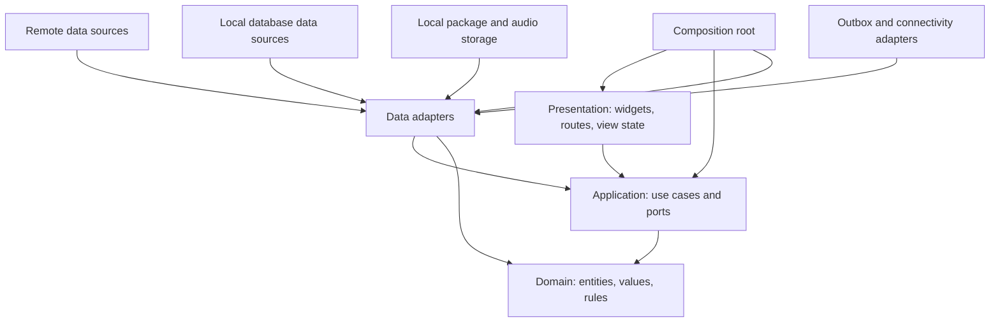

# Prolific Flutter Mobile Architecture

## Document control

| Item              | Value                                                                                                                                                                        |
| ----------------- | ---------------------------------------------------------------------------------------------------------------------------------------------------------------------------- |
| Status            | Sprint 1 architecture baseline; implementation pending                                                                                                                       |
| Scope             | Flutter mobile application boundaries and dependency rules                                                                                                                   |
| Related contracts | [Offline Lesson Package](./offline-lesson-package.md), [Sync Service](../06-core-backend/sync-service.md), and [shared contracts](../../packages/shared-contracts/README.md) |
| Domain authority  | [Canonical Domain Model](../architecture/canonical-domain-model.md)                                                                                                          |
| Review date       | YYYY-MM-DD                                                                                                                                                                   |

## Purpose and constraints

The mobile application is an offline-first client of the Core API. It renders published lesson packages, persists registered-learner activity locally before network delivery, and preserves exact Lesson Revision identity. It does not own publication, server authorization, canonical progress reconciliation, or content-generation rules.

This document defines boundaries, not a final directory listing. Flutter state management and the local database package remain later design decisions. Implementations must not allow a package choice to reverse the dependency direction below.

## Feature-first structure

```text
lib/
  app/                    # bootstrap, routing composition, lifecycle, shared shell
  core/                   # cross-feature primitives with explicit ownership
    contracts/            # generated/manual adapters around versioned specifications
    errors/               # application-safe failures and mapping
    network/              # transport configuration and connectivity signals
    storage/              # local database/file abstractions
    sync/                 # outbox coordination boundary
  features/
    onboarding/
    language_selection/
    home/
    content_discovery/
    lesson_details/
    downloads/
    reading_player/
    progress/
    authentication/
    profile_settings/
```

Each feature may contain `presentation`, `application`, `domain`, and `data` directories when it needs them. A feature must not create empty layers. Shared code moves to `core` only when at least two features need the same stable abstraction and one feature cannot reasonably own it.

## Dependency direction



- Domain code imports neither Flutter UI nor data-source packages.
- Application code depends on domain types and repository/port interfaces, never concrete storage or HTTP clients.
- Data adapters implement application-owned interfaces and map external representations at the boundary.
- Presentation invokes use cases and renders explicit view state; widgets do not call HTTP, files, databases, or the outbox directly.
- The composition root is the only place that wires concrete implementations.

## Layer responsibilities

### Presentation

Presentation owns screens, routes, widgets, accessibility semantics, input handling, and transient view state. It translates application results into loading, content, empty, offline, recoverable-error, and terminal-error states. It never decides whether a lesson is complete or whether an event can be deleted from the outbox.

### Application and use cases

Application use cases coordinate repositories, clocks, connectivity signals, transactions, and lifecycle policies. Representative use cases include `LoadHome`, `ChangeLanguage`, `DownloadLessonRevision`, `StartReadingSession`, `RecordReadingPosition`, `CompletePractice`, `RestoreSession`, and `SynchronizeOutbox`.

Multi-store operations are expressed as one application-owned transaction. In particular, recording durable progress and inserting its immutable outbox event must succeed atomically or fail without advancing either record.

### Domain

The domain layer holds mobile-relevant rules and values such as Lesson Revision identity, Reading Position, pace preset, reading mode, session outcome, package compatibility, integrity state, and outbox disposition. Server-owned authorization and publication rules are represented as received facts, not reimplemented as mobile authority.

### Data

Data adapters map versioned JSON, local rows, manifests, and file metadata into domain/application types. Mapping must reject missing identity, unsupported schema/profile semantics, invalid enum values, and inconsistent Revision references instead of filling them silently.

## Repository and port interfaces

Application-owned interfaces describe capabilities rather than storage technology:

- `CatalogRepository`: cached discovery reads and online refresh.
- `LessonPackageRepository`: download candidate, verify, promote, enumerate, and remove packages.
- `ReadingSessionRepository`: create, restore, update, and finish local sessions.
- `ProgressRepository`: local durable progress and derived summaries.
- `OutboxRepository`: append immutable events, lease batches, and apply per-event outcomes.
- `AccountRepository`: session/account state and privacy-safe logout/deletion cleanup coordination.
- `PreferencesRepository`: language, accessibility, and non-sensitive settings.
- `SyncGateway`: versioned sync request/response transport.
- `ConnectivityMonitor`: advisory connectivity state and change signals.
- `Clock` and `IdentifierFactory`: injectable UTC time and UUID generation.

Repository interfaces must not expose database rows, HTTP response classes, file handles, or package-specific exception types.

## Data sources and storage

### Remote data sources

Remote adapters call versioned `/api/v1` endpoints, attach authentication and correlation headers, validate shared contracts, map stable API errors, and treat transport reachability as distinct from server acceptance. A connectivity signal never guarantees that a request will succeed.

### Local data sources

The local structured store owns cached catalog metadata, package indexes, Reading Sessions, progress projections, immutable outbox events, sync cursors, and non-secret settings. Its technology must support migrations and atomic progress-plus-outbox writes. The package choice is due before Sprint 5 implementation.

### Local files and audio

Package archives, expanded immutable content, and tutorial audio live behind a file-storage port. Candidate files use isolated temporary storage. Only a structurally compatible package whose Package Checksum and every required Asset Checksum pass is atomically promoted to `available`. Files never hold tokens, learner progress, or authoritative sync state.

Secure platform storage holds access/refresh credentials and other secrets. Ordinary preferences, logs, databases, package manifests, and backups must not contain them.

## Offline-first read and write strategy

Reads prefer the last verified local representation and may refresh it online. A refresh failure does not erase usable cached content. Learner-visible packages always resolve one exact published Lesson Revision and are never assembled from mixed Revisions.

Registered-learner activity writes locally first. The local transaction updates the session/progress state and appends one immutable event with a client-generated UUID. Network synchronization happens afterward. A server acknowledgement changes delivery state, not the historical local event payload.

Guests may use only temporary session state. They cannot create durable progress, downloads, streaks, or synchronization events. Guest-to-account migration remains a later onboarding decision and must never occur silently.

## Outbox boundary and connectivity

The outbox owns immutable event envelopes and delivery metadata separately. Retry count, next-attempt time, lease state, and last failure may change; `eventId`, event schema version, Revision identity, occurrence time, and payload may not. Only `accepted` or payload-matching `duplicate` outcomes permit synchronized removal/compaction. Rejected and retryable events remain recoverable according to the [sync design](../06-core-backend/sync-service.md).

Connectivity monitoring is advisory. It may trigger foreground synchronization after reconnection, but background scheduling remains a Sprint 8 decision subject to platform limits and battery policy.

## Error mapping

Adapters map failures into a small application taxonomy:

| Failure                             | Presentation expectation                                              |
| ----------------------------------- | --------------------------------------------------------------------- |
| Offline/unreachable                 | Continue from verified local data where possible; offer retry         |
| Authentication required/expired     | Preserve recoverable local data and request authentication            |
| Forbidden/account deactivated       | Stop protected work; do not replay under another identity             |
| Validation/contract incompatibility | Quarantine unsafe data and provide update/support path                |
| Integrity failure                   | Keep prior verified Revision; quarantine candidate                    |
| Conflict                            | Reload authoritative state or route to a defined reconciliation flow  |
| Retryable service failure           | Retain original event and schedule bounded retry                      |
| Permanent event rejection           | Retain evidence and surface the documented recovery/data-loss warning |
| Unexpected                          | Record privacy-safe correlation data and show a safe generic state    |

Raw SQL, stack traces, tokens, local absolute paths, and unfiltered server bodies never reach UI messages or telemetry.

## Session restoration

An active Reading Session checkpoints the exact Lesson Revision ID, package/profile versions, mode, selected pace, last stable Reading Position, elapsed active time, and interruption state. After a temporary interruption, the app reloads the same verified package and resumes from the last committed stable position. Missing, corrupt, incompatible, or policy-withdrawn content produces an explicit non-destructive recovery state.

Tutorial and practice states remain separate. Tutorial replay never creates lesson completion. Completion is recorded only for eligible practice reaching the final supported position without abandonment under the later approved timing policy.

## Planned feature ownership

| Feature            | Owns                                                              | Does not own                           |
| ------------------ | ----------------------------------------------------------------- | -------------------------------------- |
| App bootstrap      | composition, lifecycle, routing shell, restoration entry          | feature business rules                 |
| Onboarding         | first-run flow and guest/account choice                           | authentication implementation policy   |
| Language selection | preferred language selection and availability states              | content translation                    |
| Home               | assembled learner overview                                        | canonical progress calculation         |
| Content discovery  | categories, Topic hierarchy, catalog cache                        | publication eligibility                |
| Lesson details     | Revision descriptor, attribution, actions                         | package verification implementation    |
| Downloads          | package lifecycle and storage coordination                        | reading progress                       |
| Reading player     | tutorial/practice state machine, timing presentation, checkpoints | server reconciliation                  |
| Progress           | local summaries, history, streak presentation                     | guest durability or badge systems      |
| Authentication     | credential/session coordination                                   | identity provider choice               |
| Profile/settings   | learner preferences and account actions                           | downloaded content or outbox internals |

Bookmarks are post-MVP and are not a planned MVP feature area.

## Testing boundaries

- Domain tests cover pace, mode, completion eligibility, positions, and outbox dispositions without Flutter bindings.
- Application tests use fakes for repositories, clock, identifiers, connectivity, and transactions.
- Data tests validate mapping, schema incompatibility, database migrations, atomic writes, file promotion, and checksum failures.
- Widget tests cover states, navigation, semantics, and recovery actions without real network or storage.
- Integration tests cover progress-plus-outbox atomicity, process restoration, verified package use, and per-event sync outcomes.
- Reading-player timing tests use a controllable clock; wall-clock sleeps are prohibited.

## Deferred decisions

| Decision                                                               | Owner                          |
| ---------------------------------------------------------------------- | ------------------------------ |
| Flutter state-management package and composition conventions           | Sprint 4 mobile design         |
| Local database package, schema, migration, and encryption details      | Before Sprint 5 implementation |
| File/archive layout, audio format, storage limits, and download resume | Sprint 5 package design        |
| Timing tolerance and platform interruption details                     | Sprint 6 player design         |
| Background sync scheduling and multi-device reconciliation             | Sprint 8 sync design           |

These decisions may refine adapters but must preserve the dependency, integrity, local-first, Revision-identity, and data-loss-prevention rules in this document.
