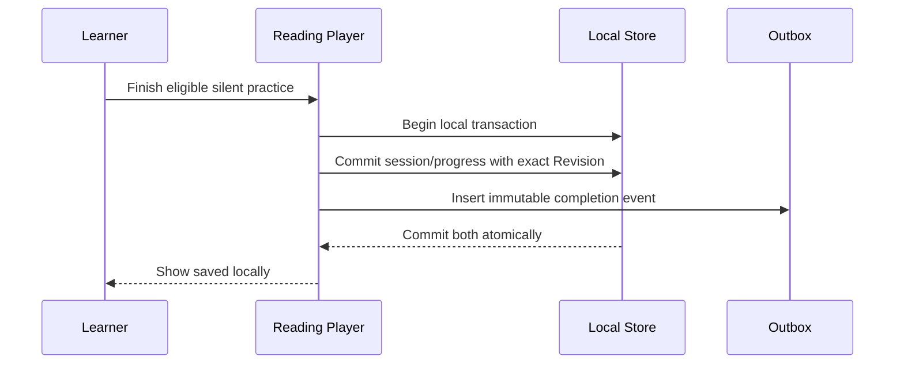
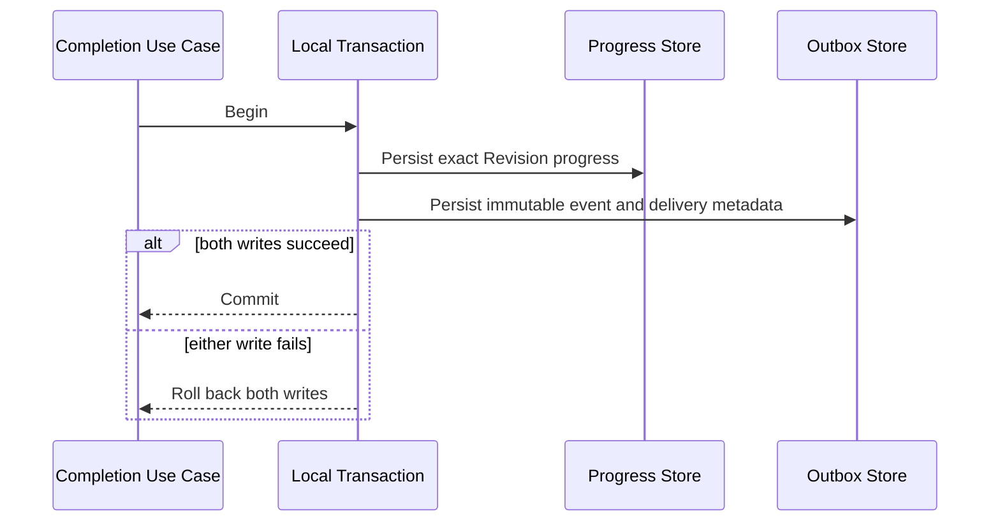
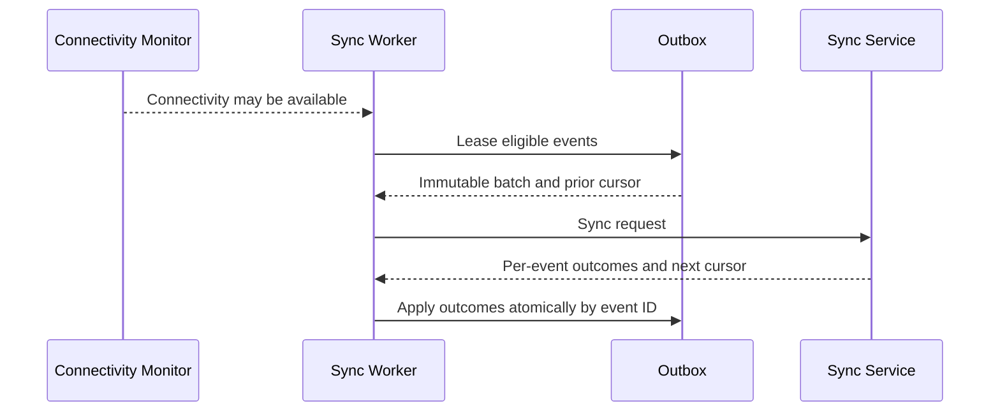
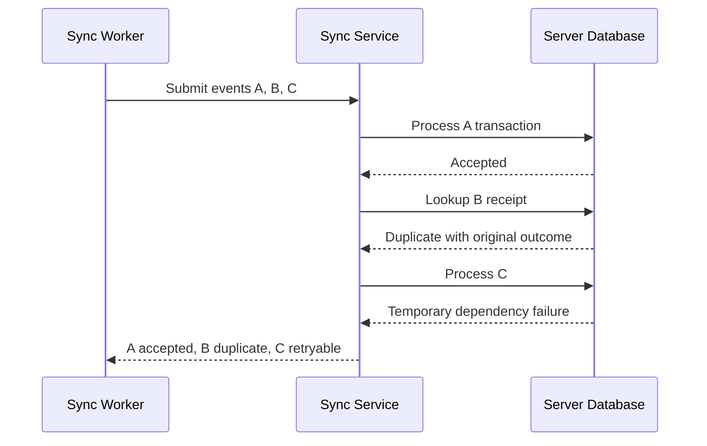
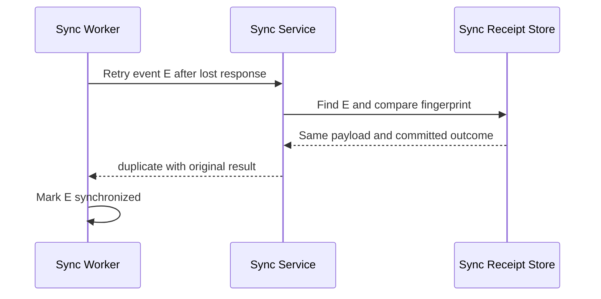
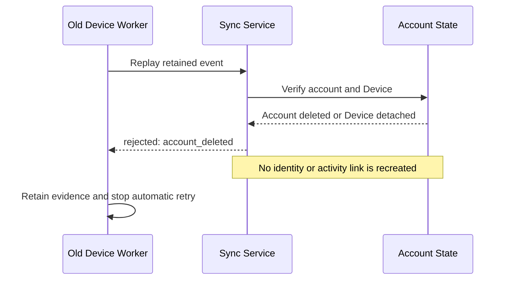
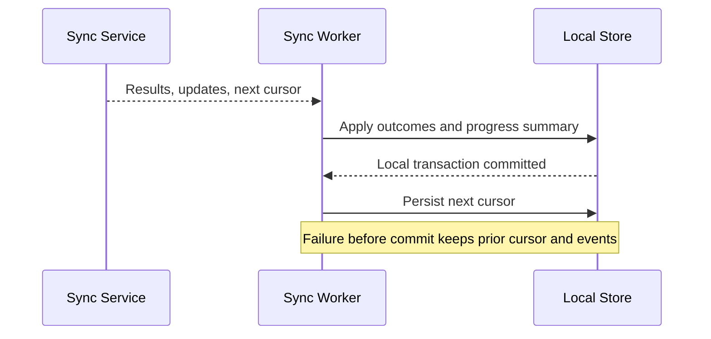

# Prolific Synchronization Service Design

## Document control

| Item                 | Value                                                                                                                                                                                                         |
| -------------------- | ------------------------------------------------------------------------------------------------------------------------------------------------------------------------------------------------------------- |
| Status               | Sprint 1 contract and service design; implementation pending                                                                                                                                                  |
| Scope                | Registered-learner reading activity synchronization                                                                                                                                                           |
| Contract authority   | [Sync request and response schemas](../../packages/shared-contracts/README.md)                                                                                                                                |
| Related architecture | [API Overview](../08-api-specification/api-overview.md), [Flutter Architecture](../05-mobile-app/flutter-architecture.md), and [ADR-017](../decisions/ADR-017-use-history-safe-deletion-and-anonymization.md) |
| Review date          | YYYY-MM-DD                                                                                                                                                                                                    |

## Purpose and invariants

Synchronization delivers registered-learner activity created while online or offline without losing, duplicating, or silently reassigning history. It is not a general replication protocol.

- The mobile client writes locally first and creates an immutable outbox event in the same local transaction.
- Every event has one client-generated UUID `eventId`, reused for every retry.
- Every lesson event references the exact immutable `lessonRevisionId` used by the session.
- The server persists a new event's outcome and its idempotency receipt atomically.
- A partial batch never makes unacknowledged events disappear.
- Device time informs history but is never the sole ordering, authorization, or conflict authority.
- Deleted/deactivated accounts and detached Devices cannot use late events to recreate identity or reattach anonymized activity.

## Responsibilities and boundaries

The mobile outbox owns event durability and retry delivery state. The sync endpoint authenticates the account/device context, validates the envelope and supported schema, processes each enumerable event independently, and returns one terminal or retryable outcome per event. Domain application services own Reading Session and progress rules. A User Progress projection is derived state, not an event source of truth.

## Identity and versioning

`deviceId` is a server-issued or server-registered pseudonymous Device UUID associated with the authenticated account. It must not embed a hardware serial, advertising ID, phone number, or other direct identifier. A local installation identity used before registration is not automatically a trusted Device identity.

`clientRequestId` identifies one batch attempt for correlation; retrying the same logical batch may reuse it, but event idempotency depends only on each `eventId`. `eventSchemaVersion` identifies the event envelope/payload contract. `localSchemaVersion` reports the client's local persistence schema for diagnostics and compatibility; neither is the API version, Package Schema Version, or Lesson Revision Number.

## Event envelope

Each event contains:

- immutable `eventId`, `eventType`, `eventSchemaVersion`, UTC `eventTimestamp`, `entityId`, and typed `payload`;
- exact `lessonRevisionId` for lesson/session events, plus session and Revision context required by the versioned event type;
- the pseudonymous Device identity supplied at request scope and any session-local sequence required by the event type; and
- mutable delivery metadata such as local retry count outside the immutable payload fingerprint.

Supported MVP event types remain `tutorial_started`, `tutorial_progressed`, `tutorial_completed`, `practice_started`, `practice_progressed`, and `practice_completed`. Tutorial completion never means lesson completion.

## Mobile outbox lifecycle

```text
pending -> leased -> submitted -> accepted/duplicate -> acknowledged/compactable
                    |          -> retryable -> pending
                    |          -> rejected -> retained_for_resolution
                    -> unknown_transport_outcome -> pending
```

1. The application transaction commits local session/progress state and an immutable outbox event.
2. A sync worker leases eligible events without changing payloads.
3. The worker submits a bounded batch with the prior cursor.
4. It matches results by `eventId`, not array position.
5. `accepted` and payload-matching `duplicate` become synchronized.
6. `retryable`, missing, malformed, or transport-uncertain results retain the original event and ID.
7. `rejected` events remain retained with safe reason evidence until the recovery/data-loss workflow is completed.

Application termination or lease expiry returns unresolved events to eligibility. Leases prevent simultaneous local workers; they do not replace server idempotency.

## Processing outcomes

| Outcome     | Server meaning                                                          | Client action                                     |
| ----------- | ----------------------------------------------------------------------- | ------------------------------------------------- |
| `accepted`  | Event, domain result, and receipt durably committed                     | Mark synchronized                                 |
| `duplicate` | Same ID and canonical payload already committed                         | Mark synchronized using original outcome          |
| `rejected`  | Permanently invalid under current identity/contract/domain state        | Retain for resolution; do not retry automatically |
| `retryable` | Safe completion is temporarily unavailable or reconciliation is pending | Retain unchanged and retry with backoff           |

A reused event ID with a different canonical payload is permanently rejected as `idempotency_conflict`; it never changes the stored result. A structurally enumerable request returns partial success with one outcome for every event. A malformed request that cannot be enumerated uses the standard API error envelope.

## Idempotency and transactions

For each new event the service transaction:

1. resolves authenticated account and active Device state;
2. searches the idempotency receipt in the correct account/device scope;
3. compares a canonical payload fingerprint when a receipt exists;
4. validates schema, Revision identity, session sequence evidence, and domain rules;
5. writes the Reading Session event/domain result and updates projections; and
6. writes the immutable receipt and outcome before commit.

No `accepted` acknowledgement is returned before commit. A duplicate returns the effective original outcome. The idempotency retention period must exceed the supported offline/retry window and is a Sprint 8 design decision.

## Ordering and multiple devices

Session sequence expresses client intent within one session, but delivery may be late or out of order. The server records receipt and processing timestamps, validates monotonic/domain transitions where required, and may return a retryable dependency outcome until an earlier event arrives. It must not discard a valid later event silently.

Events from different Devices are independent evidence. The server never applies device-time last-write-wins to canonical progress. Exact multi-device progress reconciliation, session overlap handling, streak consequences, and tie-breaking are Sprint 8 decisions. Until approved, the service preserves all valid event evidence and produces only projections that are safe under the known rules.

## Server time and sync cursor

Every response contains `serverTimestamp` and an opaque `nextCursor`. A cursor represents the server-side change-feed position visible to the authenticated account; it is not a timestamp, event ID, or authorization token. The client stores it only after it safely applies the response. Missing/expired/invalid cursors yield a defined resynchronization path without deleting local outbox data.

Cursor format, expiry, reset, server-to-client change types, page limits, and snapshot behavior are Sprint 8 decisions. Clients must treat cursors as opaque and scoped to the account/device context returned by the service.

## Retry and permanent rejection

Retryable failures use bounded exponential backoff with jitter, respect server `Retry-After` guidance, and avoid battery/network storms. Exact base delay, maximum, batch limits, retry ceilings, and background triggers are Sprint 8 decisions. A retry counter is delivery metadata and never changes event identity.

Permanent reasons include unsupported retired schema outside the support window, invalid immutable Revision reference, impossible domain transition, idempotency conflict, and account/device deletion or deactivation. Rejected payloads are not silently deleted or rewritten. The client retains minimal evidence, prevents infinite automatic replay, and presents the approved recovery/export/data-loss warning when required.

## Account deletion, retention, and data-loss prevention

Before processing any event, the server verifies the account and Device are active and still related. Once deletion/deactivation blocks synchronization, late events return stable rejection codes such as `account_deleted` or `device_deactivated`. They cannot reactivate an account, recreate an identity link, or attach activity to a different account.

The server retains Sync Receipts long enough to cover the supported offline window, subject to approved privacy/retention policy. It retains no raw secrets for idempotency. Mobile cleanup distinguishes credentials, packages, durable activity, and outbox evidence; logout or deletion does not silently destroy pending events when a warning or recovery path is possible. Exact periods and legal bases remain specialist approval items under ADR-017.

## Observability and correlation

- Each request has a correlation ID shared across gateway, application-service, database, and response logs.
- `clientRequestId`, privacy-safe Device reference, event count, outcome counts, latency, retry class, cursor state, and stable error code are observable.
- Raw lesson payload text, tokens, direct identifiers, credentials, and unrestricted event payloads are not logged.
- Metrics cover batch throughput, accepted/duplicate/rejected/retryable rates, idempotency conflicts, receipt latency, cursor resets, late deleted-account replays, and outbox age reported by consenting clients.
- Alerts distinguish dependency outages from growing permanent rejection or compatibility rates.

## Sequence diagrams

### Offline completion and outbox creation



### Outbox record durability



### Reconnection and batch submission



### Partial-success synchronization



### Retryable event retention

```mermaid
sequenceDiagram
  participant W as Sync Worker
  participant O as Outbox
  participant S as Sync Service
  W->>S: Submit event with original ID
  S-->>W: retryable and safe error code
  W->>O: Release lease; retain payload and ID
  O-->>W: Eligible after backoff and jitter
  W->>S: Retry unchanged event
```

### Duplicate-event handling



### Deleted-account late replay rejection



### Cursor advancement after safe application



## Deferred implementation decisions

- Maximum batch count/bytes and event support window.
- Exact retry/backoff ceilings and background scheduling.
- Receipt retention and cleanup policy.
- Cursor encoding, expiry, reset, and server change-feed contract.
- Multi-device reconciliation and overlapping-session rules.
- Exact local database/outbox leasing implementation.
- Authentication provider and Device registration/revocation protocol.

These decisions must be approved before Sprint 8 implementation and may not weaken idempotency, exact Revision references, partial-success handling, or history-safe account deletion.
