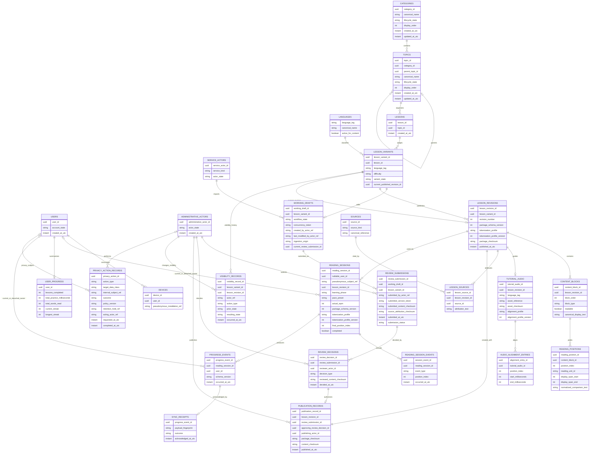
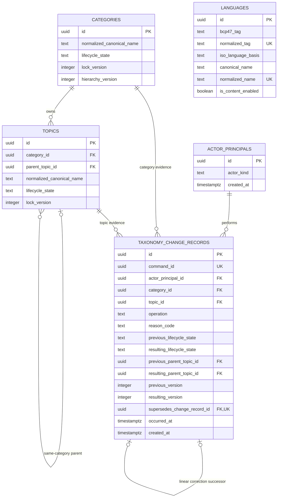
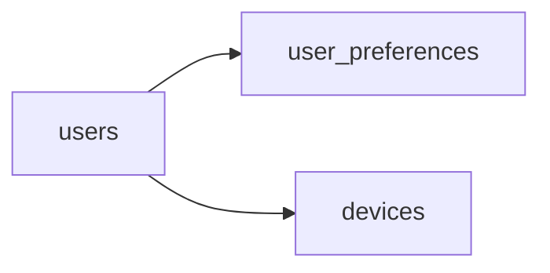
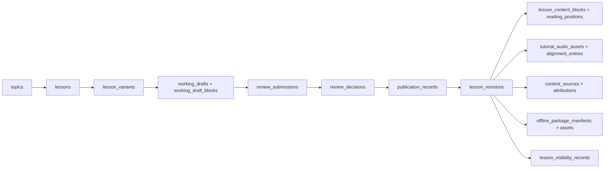
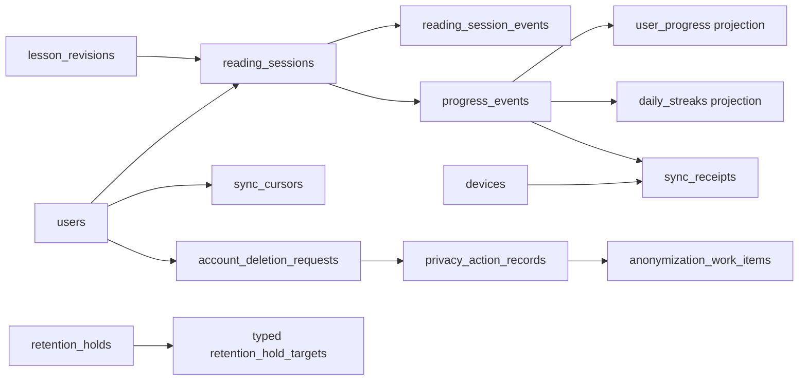

# Prolific Conceptual Entity-Relationship Model

## Document control

| Item          | Value                                                               |
| ------------- | ------------------------------------------------------------------- |
| Status        | Draft for Architecture Gate Review; not a physical schema           |
| Owner         | TBD                                                                 |
| Review date   | YYYY-MM-DD                                                          |
| Domain source | [Canonical Domain Model](../architecture/canonical-domain-model.md) |
| Terminology   | [Domain Glossary](../02-requirements/domain-glossary.md)            |

## Purpose

This conceptual ERD shows persistence candidates and cardinalities derived from the canonical domain model. It does not approve table names, column types, indexes, normalization, partitions, ORM mappings, migrations, or SQL. Conceptual attribute types exist only to make identities and relationships legible.

## Conceptual ERD

## Proposed physical design

The conceptual diagram above remains the domain authority. The physical diagrams below are review proposals only. They do not represent current PostgreSQL objects or Prisma models. Full columns, actions, constraints, indexes, and deferrals are defined in the [First Physical Schema Proposal](./first-physical-schema-proposal.md).

### Proposed first-migration foundation

The Topic parent relationship is an adjacency list. A composite `(category_id, parent_topic_id)` foreign key enforces same-Category parenthood. Exactly one audit target FK is populated; target type is derived and no `target_type` is stored. The three audit Topic-parent/supersession references are restrictive and indexed. A nullable unique constraint on `supersedes_change_record_id` gives every record at most one direct successor, so corrections form a sequential same-target chain rather than a branch; repository logic validates the terminal predecessor and acyclicity atomically. FPSD-006 approves application-owned cycle prevention with repository-only writes, least-privilege database access, the narrowly governed taxonomy-adapter Category-row lock, hierarchy/Topic version checks, atomic audit/version changes, revalidation, and concurrent reparent tests. No trigger, closure, materialized-path, or nested-set table is required in migration one.

### Deferred learner identity shell

FPSD-001 defers all three tables until authentication, account lifecycle, consent, safeguarding, device ownership, and anonymization policy are resolved. They are conceptual extension points, not migration-one objects.

### Deferred lesson, editorial, and package tables

All nodes in this diagram are deferred. Publication atomically creates one immutable Revision and Publication Record from one exact approved unchanged Submission/Decision. Approval alone is not visibility, and withdrawal/archive never mutates Revision material.

### Deferred activity, synchronization, and privacy tables

These tables are deferred pending timing, sync reconciliation/cursor/retention, authentication, anonymization, legal retention, and Privacy approvals. Identity treatment must not change Reading Session or Lesson Revision identity.

## Persistence interpretation

- `READING_SESSION_EVENTS` is justified as an append-only history candidate because tutorial/practice separation, pause/resume timing, completion evidence, and interruption recovery require chronology. Physical design may instead use a hybrid event/state representation if it preserves the same facts.
- `REVIEW_SUBMISSIONS`, `REVIEW_DECISIONS`, `PUBLICATION_RECORDS`, and `VISIBILITY_RECORDS` are append-only typed evidence. A current workflow/visibility field may optimize commands but must remain derivable from this chronology.
- `ADMINISTRATIVE_ACTORS` and `SERVICE_ACTORS` show distinct security contexts and stable references. The ERD does not approve physical inheritance, polymorphic-key syntax, credential storage, or actor-profile snapshots.
- Review notes and capability snapshots are required conceptually but omitted from the compact diagram; their restricted physical representation remains controlled design work.
- One Publication Record creates exactly one Lesson Revision in the same transaction and references the exact approved Review Submission/Decision and checksums.
- `CATEGORIES` and `TOPICS` have stable UUIDs and exactly two conceptual lifecycle values: `ACTIVE` and `ARCHIVED`. New rows default to `ACTIVE`; `DELETED`, hidden, and withdrawal are not taxonomy lifecycle states. Localized display names are conceptually required but their physical representation is deferred.
- Every Topic belongs to exactly one Category; an optional parent belongs to that same Category. Cycle prevention and same-Category subtree reparenting require transactional validation against authoritative relationships.
- Active Category canonical names are normalized-unique. Active Topic canonical names are normalized-unique within `(category_id, parent_topic_id)` sibling scope. FPSD-005 approves the comparison profile; TN-001 through TN-022 must become executable automated tests before taxonomy repository acceptance.
- Taxonomy display order is explicit. Effective visibility, ancestry paths, and discovery eligibility may be projections, but they cannot authorize hierarchy mutation or replace lifecycle truth.
- Referenced taxonomy is archived, never cascade-deleted. Archived ancestry removes Effective Visibility without rewriting descendants. Restoration revalidates uniqueness, parent validity, Category consistency, Effective Visibility, and concurrency. Taxonomy audit evidence for rename, reorder, reparent, state change, restoration, and Lesson reassignment is required conceptually.
- `LESSON_VARIANTS` provides the stable Language/Difficulty stream. Conceptual uniqueness is one active Variant per Lesson, Language, and Difficulty unless a later ADR introduces parallel editions.
- `WORKING_DRAFTS` represents zero or one active editable draft per Variant. Its concurrency token is conceptual; exact representation and whether drafts use a dedicated physical structure remain open.
- `LESSON_REVISIONS` represents immutable published snapshots with UUID identity and a positive, monotonically allocated number unique within one Variant. The current-revision relationship is conceptual and must be efficient without making historical Revisions mutable.
- `CONTENT_BLOCKS` and `READING_POSITIONS` expose the minimum conceptual structure required for deterministic order, stable block identity, exact display reconstruction, highlighting, completion, and historical interpretation. They do not decide between normalized relations and immutable JSON storage.
- Reading Position indexes are zero-based, contiguous within one Revision, and backed by block-relative Unicode-scalar half-open spans. Tokenization/Alignment Profile names and positive versions preserve the interpretation used at publication.
- Package and Asset Checksums use SHA-256 under ADR-014. A Package Manifest remains a value object/artifact unless delivery evidence justifies a separate record.
- `USER_PROGRESS` is a derived read model and may be rebuilt. It is not authoritative session history.
- `SYNC_RECEIPTS` is authoritative idempotency evidence for server processing and must outlive ordinary request execution according to an approved retention period.
- `USERS` holds learner identity/account lifecycle separately from activity. Retained Reading Sessions and Progress Events support nullable or replaceable learner linkage while preserving stable session, event, and Lesson Revision identity; exact anonymization mapping is deferred.
- `PRIVACY_ACTION_RECORDS` is restricted, append-only, and data-minimized. A Retention Hold reference is conceptual and may later map to a protected related structure; exact physical mapping and policy are not approved here.
- Administrative/Service Actor deactivation never cascades into editorial, taxonomy, or privacy evidence. Mutable actor profiles may be minimized while stable or pseudonymous historical attribution remains.
- No relationship shown authorizes destructive cascade into Revisions, Sessions, Progress Events, Sync Receipts, editorial/publication/taxonomy audit, or Privacy Action Records.
- Exact legal basis, anonymization algorithm, identity/activity detachment representation, and all retention periods remain external specialist policy/physical-design decisions under ADR-017.
- Nullable conceptual references do not approve an exact physical mapping. A registered Reading Session begins linked to a User; approved anonymization may later detach or replace that linkage without changing session or Revision identity.

## Concepts intentionally not represented as their own central tables

| Concept                             | Reason                                                                                                                                                                                                      |
| ----------------------------------- | ----------------------------------------------------------------------------------------------------------------------------------------------------------------------------------------------------------- |
| Guest Session                       | Temporary, non-account, non-synchronized context. Limited anonymous analytics may use a separate minimized telemetry identifier under privacy policy.                                                       |
| User Preferences                    | Deferred by FPSD-001 with the learner identity shell; the conceptual classification remains an aggregate member.                                                                                            |
| Offline Lesson Package and Manifest | The package remains a transport artifact/value object. Deferred manifest/asset descriptor tables are proposed only to support deterministic reconstruction/delivery evidence; binary bytes remain external. |
| Outbox Event                        | Durable mobile-local queue record. It is not necessarily a server table; Progress Event and Sync Receipt represent the server-relevant concepts.                                                            |
| Sync Request                        | Transport envelope only.                                                                                                                                                                                    |
| Sync Cursor                         | A deferred server-side table is proposed, but its opaque representation, expiry, and reset lifecycle remain unresolved.                                                                                     |
| Daily Streak                        | A deferred rebuildable projection table is proposed only if the approved streak query/update workload justifies separate storage.                                                                           |
| Approval Evidence                   | Evidentiary relationship/value object derived from exact approved Review Decision, Review Submission, checksums, actor, time, and authorization evidence.                                                   |
| Superseding Record                  | Corrective relationship between immutable audit records; physical representation may be a self-reference or typed companion structure.                                                                      |
| Taxonomy localization and audit     | Localization remains deferred; typed `taxonomy_change_records` are proposed in migration one because governed mutations require append-only evidence.                                                       |

## Physical-design questions still deferred

- The first five-table Prisma/PostgreSQL mapping is human-approved in the [First Physical Schema Approval](../reviews/FIRST-PHYSICAL-SCHEMA-APPROVAL.md). Prisma schema implementation is authorized; migration generation/execution remains separately gated. Later physical mappings in this ERD remain deferred.
- Exact Working Draft concurrency-token representation, physical storage, and locking strategy. Variant uniqueness, one active draft, Variant-scoped revision numbering, atomic publication, and immutable Revisions are approved by [ADR-013](../decisions/ADR-013-use-lesson-variants-and-immutable-revisions.md).
- Exact revision-number allocation query and current-published-revision access implementation.
- Physical JSON-versus-relational mapping for blocks, positions, and alignment; exact Language-specific tokenizer rules; and exact canonical-JSON library. Their conceptual boundary is approved by [ADR-014](../decisions/ADR-014-use-structured-content-blocks-and-revision-packages.md).
- Package archive/layout, compression, delivery, asset storage, and compatibility-window mechanics.
- Exact actor-table/inheritance/reference mapping, permitted minimal profile snapshots, role/capability persistence, restricted review-note storage, and superseding-record mapping. Their conceptual boundary is approved by [ADR-015](../decisions/ADR-015-persist-editorial-workflow-and-admin-actor-audit.md).
- Taxonomy localization storage, ordering allocation, optional recursive-query/materialized-ancestry projections, projection refresh, and never-referenced temporary-data treatment. Normalization, cycle prevention, `ACTIVE`/`ARCHIVED` lifecycle semantics, and conceptual privilege separation are approved by FPSD-005/FPSD-006/FPSD-013/FPSD-014.
- Local database schema, outbox transaction design, and Sync Cursor storage.
- Exact identity/activity detachment, Privacy Action Record/Retention Hold mapping, anonymization implementation, deletion tombstones, and backup-restore reapplication mechanics within [ADR-017](../decisions/ADR-017-use-history-safe-deletion-and-anonymization.md).
- Multi-device ordering/reconciliation and idempotency-retention periods.
- Indexes, partitioning, JSON versus relational fields, foreign-key actions, and timestamp precision.
