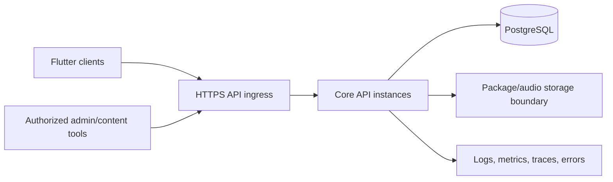

# Prolific Deployment Architecture

## Purpose

This document defines provider-neutral deployment controls for the Core API, PostgreSQL, future administration/content components, and mobile release compatibility. It does not select a hosting, observability, secret-management, object-storage, or mobile distribution provider.

## Deployment principles

- Build an immutable artifact once and promote the same verified artifact through environments.
- Keep configuration and secrets outside source and artifacts; validate required configuration at startup.
- Deploy reviewed, committed Prisma migrations under Core API ownership. Runtime schema synchronization and production schema push are prohibited.
- Preserve backward compatibility across mobile clients, APIs, packages, events, and the database because clients may remain offline through multiple releases.
- Separate migration, application deployment, health verification, and traffic promotion into observable steps.
- Prefer run-forward correction. Any rollback must respect irreversible data/schema changes and the compatibility window.

## Logical topology

The object/package delivery mechanism remains unselected. Direct database access is restricted to controlled administration, migrations, backups, and approved diagnostics; clients never connect to PostgreSQL.

## Release sequence

1. Validate source, dependencies, contracts, tests, builds, migration plan, and secret/config manifest.
2. Produce immutable, identifiable artifacts and a release record.
3. Back up and prove recovery readiness where a migration can affect stored data.
4. Run pre-deployment compatibility and migration-status checks.
5. Deploy reviewed migrations through the controlled migration job/role.
6. Deploy application instances with readiness withheld.
7. Pass health, compatibility, and smoke checks.
8. Shift traffic progressively where supported and observe error/latency/sync signals.
9. Complete or execute the approved run-forward/rollback plan.

Database changes use expand/migrate/contract sequencing when old and new application versions may overlap. A destructive contract step waits until no supported application or mobile contract depends on the old shape.

## Required evidence

Each release records artifact identity, source revision, configuration schema version, migrations applied, approver, environment, timestamps, health/smoke results, monitoring window, and rollback/run-forward decision. Evidence excludes secret values.

## Supporting documents

- [Environments](./environments.md)
- [CI/CD](./ci-cd.md)
- [Hosting](./hosting.md)
- [Monitoring](./monitoring.md)
- [Testing Strategy](../12-testing/testing-strategy.md)

## Deferred decisions

Hosting provider, regions, domains, TLS/DNS services, container/orchestration service, managed PostgreSQL, object storage/CDN, secret manager, monitoring/crash providers, backup provider/retention, availability/recovery targets, and production promotion authority require later operational approval.
