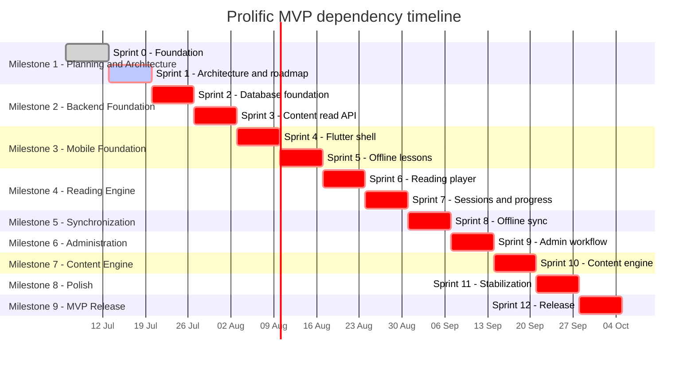

# Prolific Platform Master Roadmap

> **Planning authority:** This is the highest-level implementation roadmap for Prolific. Detailed requirements, architecture decisions, and sprint plans must remain consistent with it and with `AGENTS.md`. A roadmap item does not override an explicit MVP exclusion or approve an unresolved technology choice.

## Project information

| Item                | Value                                                                                                                                |
| ------------------- | ------------------------------------------------------------------------------------------------------------------------------------ |
| Project             | Prolific                                                                                                                             |
| Tagline             | Read. Learn. Grow.                                                                                                                   |
| Mission             | Build South Africa's leading knowledge and reading fluency platform.                                                                 |
| Platform components | Flutter mobile application; core backend API; PostgreSQL database; content engine; admin dashboard; offline synchronization platform |
| Current status      | Sprint 2.29 Topic mutation implemented; final disposable revalidation pending and hierarchy remains blocked                          |

## Progress dashboard

| Measure              | Current state                                                                                                                           |
| -------------------- | --------------------------------------------------------------------------------------------------------------------------------------- |
| Current milestone    | Milestone 2 - Backend Foundation (in progress)                                                                                          |
| Current sprint       | Sprint 2 - Database and Backend Foundation; started 2026-07-17                                                                          |
| Overall progress     | 2 of 13 sprints complete (approximately 15% by sprint count)                                                                            |
| Completed milestones | 1 of 9                                                                                                                                  |
| Current blockers     | Governed hierarchy, authentication/authorization, seeds, APIs, additional migrations, deployment, and Flutter remain gated              |
| Upcoming sprint      | Sprint 3 - Core Content Read API                                                                                                        |
| Risk level           | Medium because physical persistence, privacy/legal, mobile package, and later sync decisions remain intentionally deferred              |
| Repository status    | Monorepo scaffold complete on `main`; CI configured                                                                                     |
| Environment status   | Cleared: Docker/PostgreSQL healthy on `desktop-linux`; Flutter/Dart resolve under `C:\Development\flutter`; no legacy process reference |
| Documentation status | Sprint 2.29 narrow Topic contract, atomic mutation, relationship/order preservation, DI, rollback, and review complete                  |

Progress is based on completed sprints, not elapsed time or effort. Sprint acceptance and exit criteria determine completion.

## Scope reconciliation

The MVP includes lessons completed, total reading time, words read, recent sessions, and current/longest daily streaks for registered learners. Achievements, badges, points, leaderboards, community challenges, and broad gamification remain future candidates. Bookmarks are post-MVP. Sprint 7 delivers only the approved basic progress and streak model.

Administrative analytics in Sprint 9 are limited to operational information required for content review, auditability, and safe administration. Advanced business intelligence and cohort analytics remain outside the MVP.

Content generation in Sprint 10 means a controlled scripting/import workflow that produces drafts. AI-generated lesson content is not an MVP dependency, and the content engine cannot publish directly.

## Roadmap at a glance

| Milestone                    | Sprints | Status      | Outcome                                                                |
| ---------------------------- | ------- | ----------- | ---------------------------------------------------------------------- |
| 1. Planning and Architecture | 0-1     | Completed   | Approved foundation, contracts, and implementation sequence            |
| 2. Backend Foundation        | 2-3     | In progress | PostgreSQL-backed core API and controlled lesson read workflow         |
| 3. Mobile Foundation         | 4-5     | Planned     | Navigable Flutter shell and durable offline lesson access              |
| 4. Reading Engine            | 6-7     | Planned     | Tutorial, silent practice, sessions, and local progress                |
| 5. Synchronization           | 8       | Planned     | Idempotent delayed synchronization and conflict handling               |
| 6. Administration            | 9       | Planned     | Authorized review and publishing operations                            |
| 7. Content Engine            | 10      | Planned     | Validated draft ingestion and content preparation                      |
| 8. Polish                    | 11      | Planned     | Security, accessibility, reliability, performance, and release quality |
| 9. MVP Release               | 12      | Planned     | Production deployment and supported launch                             |

---

## Milestone 1 - Planning and Architecture

**Status:** Completed

### Objective

Establish a healthy development foundation and an approved, internally consistent plan for implementation.

### Business value

Reduces rework and protects the offline-first reading experience by resolving boundaries and contracts before feature code and data structures become expensive to change.

### Deliverables

- Verified monorepo, toolchains, Docker/PostgreSQL, CI, and Android build.
- Master and MVP roadmaps.
- Mobile, backend, database, API, offline-package, and synchronization designs.
- Canonical domain model, conceptual ERD, shared contract specifications, domain glossary, architecture decisions, and formal Architecture Gate review.
- Explicit register of unresolved product and technology decisions.

### Risks

- Unresolved state management, local database, storage, audio, tokenization, pacing, and account policies; Prisma implementation details remain to be designed without reopening the ORM selection.
- Documentation can diverge if contracts are copied rather than referenced.
- Prematurely approving a technology could constrain offline reliability.

### Exit criteria

- Sprint 0 and Sprint 1 acceptance criteria pass.
- Roadmap, architecture, ADR, ERD, and contract documents are reviewed together for contradictions.
- Every unresolved decision has an owner or target sprint and does not block Sprint 2 entry work.

### Sprint 0 - Repository and Environment Foundation

**Status:** Completed

**Goal:** Create an executable, repeatable development foundation outside OneDrive.

**Scope:** Monorepo scaffold; Flutter and NestJS scaffolds; PostgreSQL Docker Compose service; CI; linting; formatting; smoke tests; Android debug build; Git `main` alignment; Node, npm, Flutter, Android, Java, and Docker verification.

**Excluded work:** Product screens, authentication, database entities or migrations, lesson APIs, reading logic, synchronization implementation, administration, and content processing.

**Deliverables:** Repository layout, root automation, Flutter scaffold, API scaffold, Compose definition, CI workflow, environment example, and verified debug APK.

**Acceptance criteria:** Required paths exist; Git is healthy; CI passes; Flutter Doctor is healthy and uses JDK 17; API and mobile smoke tests pass; Android APK builds; PostgreSQL reports healthy; no project or SDK path points to OneDrive.

**Validation commands:**

```powershell
git status
npm ci
npm run ci
flutter doctor -v
Set-Location apps/mobile; flutter build apk --debug; Set-Location ../..
docker compose config
docker compose up -d
docker compose ps
```

**Dependencies:** Supported Windows development environment, Flutter/Android SDK, Node/npm, JDK 17, Git, and Docker Desktop.

### Sprint 1 - Architecture, Contracts, and Roadmap

**Status:** Completed

**Goal:** Produce the reviewed documentation foundation required to begin database implementation safely.

**Scope:** Master/MVP roadmaps and PRD; canonical domain model and glossary; Flutter and backend architectures; API conventions; offline lesson-package and synchronization designs; database overview; conceptual ERD; shared JSON contract specifications; foundational ADRs, including the approved MVP access and reading rules; open questions; Architecture Gate 001.

**Excluded work:** Flutter screens, controllers, authentication code, entities, migrations, APIs, player logic, sync code, admin features, and content-engine code.

**Deliverables:** Version-controlled documents and specification-only contracts with working indexes; product/domain/database/mobile/backend/offline/sync architecture; shared strict JSON Schemas; testing/deployment/security/privacy baselines; ADR-011 through ADR-017; explicit unresolved-decision and deliverable-re-scope registers; Architecture Gate 001 `PASS`; Sprint 1 Closure Review `PASS WITH CONDITIONS`; and the Sprint 2 Entry Checklist.

**Acceptance criteria:** Documents use canonical terminology; lesson visibility and versioning are consistent; API and shared sync shapes agree; Mermaid diagrams render; JSON Schemas validate; internal links resolve; no application code changes; Architecture Gate 001 records `PASS`; all remaining Sprint 1 deliverables are complete or formally re-scoped before Sprint 2 begins.

**Validation commands:**

```powershell
npx prettier --check README.md docs packages/shared-contracts
npm run ci
docker compose config
git diff --check
git status --short
```

Sprint 1 validated Draft 2020-12 schemas and embedded examples without generating application models. Sprint 2 must select and pin the repository runtime/CI validator before generated or implementation-level contract validation is introduced.

**Dependencies:** Sprint 0; approved MVP scope and user flows; review of unresolved decisions before affected implementation.

---

## Milestone 2 - Backend Foundation

**Status:** In progress; Sprint 2 started 2026-07-17

### Objective

Create a transaction-safe PostgreSQL and NestJS foundation, then expose the controlled learner content read path.

### Business value

Provides the authoritative content and progress platform on which offline mobile behaviour can depend.

### Deliverables

- Versioned migrations, repository boundaries, validation, health/readiness, and foundational user/session storage.
- Category, Topic, Content Source, Lesson, Lesson Variant, Lesson Revision, and Offline Lesson Package read capabilities.
- Controlled Working Draft review/publication rules and immutable Lesson Revision handling.

### Risks

- Prisma schema choices or generated types may leak into controllers, domain models, and contracts if the approved adapter boundary is not enforced.
- Incorrect constraints can break idempotency or content immutability.
- Authentication policy may not be approved before mobile integration.

### Exit criteria

- Database and content API tests pass against PostgreSQL.
- Public routes follow `/api/v1`, OpenAPI, authorization placeholders, and safe error conventions.
- Only published content that previously passed approval is learner-visible.

### Sprint 2 - Database and Backend Foundation

**Status:** Started 2026-07-17. Docker/PostgreSQL and legacy OneDrive process entry conditions are cleared. Sprint 2.2 through Sprint 2.16 established and froze the empty five-table [Foundation Baseline](../reviews/FOUNDATION-BASELINE.md). Sprint 2.17 through Sprint 2.22 implemented all five repository adapters, and Sprint 2.23 completed the [Persistence Layer Final Review](../reviews/PERSISTENCE-LAYER-FINAL-REVIEW.md). Sprint 2.24 through Sprint 2.26 implemented taxonomy queries, Sprint 2.27 implemented [Actor Principal Provisioning](../reviews/ACTOR-PROVISIONING-SERVICE-REVIEW.md), Sprint 2.28 implemented [Category Ordinary Mutation](../reviews/CATEGORY-MUTATION-SERVICE-REVIEW.md), and Sprint 2.29 implements [Topic Ordinary Mutation](../reviews/TOPIC-MUTATION-SERVICE-REVIEW.md) with a narrow atomic repository operation that preserves Category, parent, and display order. Governed reparenting, taxonomy-audit orchestration, seeds, APIs, authentication/authorization, additional migrations, deployment, and Flutter remain blocked or unimplemented.

**Goal:** Establish migrations, persistence boundaries, foundational services, validation, and operational health endpoints.

**Scope:** Implement the approved Prisma persistence ADR; create initial schema and migrations for foundational content, user/device, reading, and sync receipt concepts; implement repositories and application-service boundaries; database configuration; liveness/readiness; migration and repository tests; minimum authentication/session persistence boundary needed by later mobile work.

**Excluded work:** Full lesson catalog API, reading player, mobile UI, full synchronization processing, admin dashboard, and content-engine workflows.

**Deliverables:** Repeatable migrations, database module/adapters, repository contracts and implementations, health endpoints, validation/error foundation, transaction conventions, and tests.

**Acceptance criteria:** Fresh and existing databases migrate safely; rollback policy is documented and tested where supported; UUID/UTC/audit/constraint rules match architecture; health distinguishes liveness from readiness; controllers remain thin; repository tests cover uniqueness, foreign keys, and transactions.

**Validation commands:**

```powershell
docker compose up -d postgres
docker compose ps
npm --workspace @prolific/core-api run lint
npm --workspace @prolific/core-api run test -- --runInBand
npm --workspace @prolific/core-api run test:e2e -- --runInBand
npm --workspace @prolific/core-api run build
```

Sprint 2 must add and document repeatable Prisma Migrate status/deployment/test commands and the approved run-forward or rollback procedure.

**Dependencies:** Sprint 1 database overview, ERD, ADR-012 through ADR-017, API conventions, verified AG-001 through AG-006, human gate approvals, and running PostgreSQL.

### Sprint 3 - Core Content Read API

**Goal:** Deliver versioned learner content endpoints and the minimum controlled publishing workflow required to make content eligible.

**Scope:** Categories, topics, sources, Lessons, Language/Difficulty Lesson Variants, immutable Lesson Revisions, package descriptors, pagination/filtering, learner visibility, publication transitions required for seeded/test content, OpenAPI, integration and authorization tests.

**Excluded work:** Mobile screens, download storage, reading sessions, learner synchronization, full admin dashboard, advanced search, recommendations, and direct content-engine publishing.

**Deliverables:** `/api/v1` content endpoints, OpenAPI definitions, source attribution, Variant/Revision/checksum handling, test fixtures, and protected publication application services.

**Acceptance criteria:** Collections paginate deterministically; only published-after-approval Lesson Revisions are returned; Working Draft and archived Variant content is hidden; Revisions are immutable; unsafe transitions fail; internal database errors are not exposed.

**Validation commands:**

```powershell
npm --workspace @prolific/core-api run lint
npm --workspace @prolific/core-api run test -- --runInBand
npm --workspace @prolific/core-api run test:e2e -- --runInBand
npm --workspace @prolific/core-api run build
npm run ci
```

**Dependencies:** Sprint 2 schema, repositories, validation, health, and approved content lifecycle rules.

---

## Milestone 3 - Mobile Foundation

**Status:** Planned

### Objective

Build a coherent Flutter application shell and verified offline lesson storage without implementing the reading engine prematurely.

### Business value

Gives learners a stable, accessible route to discover and keep useful lessons on constrained or intermittent connections.

### Deliverables

- Flutter architecture implementation, navigation, theme, session-entry UI, home, and library.
- Verified lesson downloads, local package index, file/audio storage, and durable queue foundation.

### Risks

- Unresolved local database and state-management choices.
- Storage pressure, interrupted downloads, package corruption, and Revision identity/checksum mismatch.
- Authentication backend or offline-auth policy may lag behind the UI shell.

### Exit criteria

- Critical shell and download flows pass widget/integration tests.
- A verified package remains discoverable after restart and without connectivity.
- No partial package is reported ready.

### Sprint 4 - Flutter Application Shell

**Goal:** Implement the approved Flutter boundaries and the core navigable learner shell.

**Scope:** State-management ADR implementation; dependency composition; navigation; theme/design tokens; accessible application states; guest entry and optional free-account session UI; home; English/isiZulu/Sepedi selection; public limited free library and registered complete eligible library; API client and repository interfaces.

**Excluded work:** Offline package persistence, reading player, progress tracking, sync processing, registration credential/recovery policies not yet approved, and administration.

**Deliverables:** Tested application shell, feature-module boundaries, API mapping, session state presentation, home/library flows, and error/offline states.

**Acceptance criteria:** Navigation and restoration are deterministic; widgets do not call infrastructure directly; loading/empty/error/offline states are accessible; library respects language and learner visibility; no secrets are embedded.

**Validation commands:**

```powershell
Set-Location apps/mobile
dart format --output=none --set-exit-if-changed lib test
flutter analyze
flutter test
flutter build apk --debug
```

**Dependencies:** Sprints 1 and 3; approved state management, authentication contract, role/session policy, design foundations, and API contract.

### Sprint 5 - Offline Lesson Storage and Downloads

**Goal:** Make complete lesson packages safely available without internet.

**Scope:** Registered-account download entitlement; local database adapter; lesson-package file/audio storage; download, verification, atomic promotion, update, deletion, and repair states; Lesson/Variant/Revision identity and checksum checks; downloaded library; connectivity hints; local outbox storage foundation.

**Excluded work:** Reading-player timing, completion calculation, server synchronization, background sync, and automatic deletion without learner policy.

**Deliverables:** Download manager, local package index, storage adapters, offline library, corruption/interruption recovery, queue persistence foundation, and tests.

**Acceptance criteria:** Guests receive the free-account prompt instead of a download; registered learners' complete packages survive restart; interrupted/corrupt updates preserve the last valid Revision; mismatched audio/text never opens; deletion preserves progress/outbox data; verified downloads open during temporary connectivity loss without a network request, subject to the future expiry policy.

**Validation commands:**

```powershell
Set-Location apps/mobile
dart format --output=none --set-exit-if-changed lib test
flutter analyze
flutter test
flutter build apk --debug
```

Add deterministic integration tests for restart, network loss, checksum failure, insufficient storage, and interrupted update.

**Dependencies:** Sprint 4; approved local database, package schema, storage policy, audio format, and token/alignment representation.

---

## Milestone 4 - Reading Engine

**Status:** Planned

### Objective

Deliver the core tutorial-and-practice experience and durable local session progress.

### Business value

Creates the product's primary learning value: guided reading followed by independent paced practice.

### Deliverables

- Tutorial audio, silent practice, highlighting, pacing, controls, and interruption restoration.
- Separate reading sessions, local progress, essential progress history, and outbox events.

### Risks

- Timing drift, language tokenization, layout changes, background interruptions, and low-end device performance.
- Incorrect completion rules could confuse listening with practice.
- Event/session semantics may not support later idempotent sync.

### Exit criteria

- Deterministic timing and session tests pass.
- Tutorial and practice states remain separate across restart and interruption.
- Local progress and outbox writes are atomic and durable.

### Sprint 6 - Reading Player

**Goal:** Implement accurate local tutorial playback and silent paced practice.

**Scope:** Player state machine; local tutorial audio with learner replay; word/phrase highlight timeline; 100/150/200 WPM easy/medium/hard pace engine; smooth movement; play, pause, restart, exit; font-size changes; interruption restoration; tutorial-to-practice transition; deterministic clock tests.

**Excluded work:** Server sync, achievements, social features, pronunciation scoring, speech recognition, and completion derived from audio alone.

**Deliverables:** Reading-player domain/application logic, Flutter presentation, audio adapter, timeline/highlight engine, pace presets using approved values, controls, restoration, and tests.

**Acceptance criteria:** Audio and highlight stay within approved tolerance; tutorial replay remains separate from practice; the application is silent during practice; completion requires practice to start and reach the final supported position without abandonment or early exit; controls and interruptions restore coherent state; font changes preserve logical position; downloaded lessons work offline.

**Validation commands:**

```powershell
Set-Location apps/mobile
dart format --output=none --set-exit-if-changed lib test
flutter analyze
flutter test
flutter build apk --debug
```

Run deterministic fake-clock timing suites and supported-device playback checks.

**Dependencies:** Sprint 5; approved audio/alignment format, tokenization, language-specific pace adjustments, drift, and interruption policies. Base pace values, replay, and completion follow ADR-011.

### Sprint 7 - Reading Sessions, Progress, and Local Outbox

**Goal:** Persist tutorial and practice sessions separately and create durable progress events for later synchronization.

**Scope:** Registered learner's reading-session lifecycle; safe progress checkpoints; practice completion under approved rules; lessons completed, total reading time, words read, recent sessions, and current/longest local-calendar daily streak; atomic progress-plus-outbox writes; event UUIDs, sequence, exact Lesson Revision identity, and retry metadata. Guest progress is temporary to the current session.

**Excluded work:** Server synchronization, achievements, badges, bookmarks, leaderboards, advanced statistics, social sharing, and broad gamification.

**Deliverables:** Session/progress and basic streak domain model, local repositories, outbox event creation, essential history/progress UI states, restart recovery, and failure-injection tests.

**Acceptance criteria:** Tutorial and practice use distinct sessions; audio alone cannot complete a lesson; a streak day requires at least one completed practice on the learner's local calendar day; process termination cannot save registered progress without its outbox event or vice versa; unsynced data survives restart and failed authentication; repeated attempts retain clear identities; guest state is not represented as durable account progress.

**Validation commands:**

```powershell
Set-Location apps/mobile
dart format --output=none --set-exit-if-changed lib test
flutter analyze
flutter test
flutter build apk --debug
```

Run local transaction and forced-termination recovery tests.

**Dependencies:** Sprint 6; approved completion/session model and Sprint 1 sync event contract.

---

## Milestone 5 - Synchronization

**Status:** Planned

### Objective

Synchronize delayed local progress safely across unreliable networks and retries.

### Business value

Protects learner progress and enables offline-first use without duplicate sessions or hidden data loss.

### Deliverables

- Device registration, batch submission, server deduplication, acknowledgements, retry engine, sync cursor, conflict outcomes, and permitted background triggers.

### Risks

- Lost acknowledgements, clock skew, expired authentication, out-of-order events, retention limits, and multiple devices.
- Mobile operating systems may restrict background work.

### Exit criteria

- Duplicate, partial-success, retry, interruption, and conflict tests pass end to end.
- Failed or unknown outcomes retain local events.

### Sprint 8 - Offline Synchronization

**Goal:** Deliver idempotent client/server synchronization with explicit per-event outcomes.

**Scope:** Pseudonymous device registration; sync endpoint; receipts and payload fingerprints; accepted/duplicate/rejected/retryable per-event outcomes; partial success; bounded backoff; cursor persistence; safe reconciliation; foreground/manual triggers and permitted background sync.

**Excluded work:** Real-time collaboration, guaranteed simultaneous merging beyond approved policy, silent last-write-wins by device time, and deletion of unresolved events.

**Deliverables:** Mobile sync use cases, backend synchronization module, persistence, OpenAPI/shared contracts, observability, recovery UI state, and comprehensive tests.

**Acceptance criteria:** Same event ID/payload creates one outcome; reused ID with changed payload is rejected safely without altering the original; partial batches acknowledge independently; lost responses are safe to retry; retryable/rejected events remain durable; cursor advancement is atomic with response application; no duplicate session is created and no local progress is silently discarded.

**Validation commands:**

```powershell
npm run ci
docker compose up -d postgres
npm --workspace @prolific/core-api run test:e2e -- --runInBand
Set-Location apps/mobile; flutter analyze; flutter test; Set-Location ../..
```

Run duplicate, out-of-order, partial-success, clock-skew, token-expiry, process-termination, and multiple-device integration scenarios.

**Dependencies:** Sprints 2, 3, 5, and 7; approved retention, conflict, cursor, authentication-expiry, and background-scheduling policies.

---

## Milestone 6 - Administration

**Status:** Planned

### Objective

Provide a controlled, auditable workflow for reviewing and publishing lessons and managing authorized access.

### Business value

Protects learners from unreviewed content and enables accountable content operations.

### Deliverables

- Admin dashboard, role-based access, lesson validation/review/publishing, user/role administration required by MVP, audit logs, and essential operational summaries.

### Risks

- Weak separation of duties or object authorization could expose learner data or publish unsafe content.
- Analytics scope could expand into excluded advanced BI.

### Exit criteria

- Authorization and lifecycle transition tests pass.
- Content engine and unauthorized users cannot approve or publish.
- Audit records capture every security-sensitive transition.

### Sprint 9 - Admin Content Workflow

**Goal:** Deliver the minimum secure administration experience for content lifecycle and access oversight.

**Scope:** Admin authentication/authorization; lesson list/detail; validation; transitions among draft, in-review, approved, published, archived; source review; user/role management required by the approved matrix; audit logs; essential workflow metrics.

**Excluded work:** Advanced BI, cohort analytics, marketing analytics, unrestricted user browsing, direct content-engine publication, and unapproved moderation features.

**Deliverables:** Admin dashboard and API operations, authorization matrix, optimistic concurrency, audit trail, safe operational summaries, and tests.

**Acceptance criteria:** Only authorized roles perform each transition; published requires prior approval; invalid content cannot advance; archived content disappears from discovery; every transition records actor and UTC time; object-level authorization is tested.

**Validation commands:**

```powershell
npm run ci
npm --workspace @prolific/core-api run test:e2e -- --runInBand
```

The selected admin framework must add its own format, lint, unit, build, accessibility, and e2e commands to CI.

**Dependencies:** Sprint 3 content lifecycle; approved admin technology, role matrix, authentication/security design, and audit retention.

---

## Milestone 7 - Content Engine

**Status:** Planned

### Objective

Create a repeatable content preparation and draft-ingestion workflow with validation and provenance.

### Business value

Enables the knowledge library to grow while keeping human review and publication control intact.

### Deliverables

- Structured import, category/topic association, lesson preparation, difficulty/language metadata, source attribution, validation, and draft-only ingestion.

### Risks

- Invalid source attribution, language/tokenization errors, and schema drift.
- “Generation” could be misread as approval to require AI or bypass review.

### Exit criteria

- Valid content enters as draft with complete metadata and provenance.
- Invalid content produces actionable errors and no published lesson.
- Engine credentials have no approval/publication capability.

### Sprint 10 - Content Scripting Engine

**Goal:** Deliver controlled, specification-driven lesson import and preparation that can only create drafts.

**Scope:** Content import; category/topic creation under approved rules; deterministic lesson preparation; difficulty/language metadata; source attribution; contract validation; draft ingestion integration; operator documentation.

**Excluded work:** Direct publishing, autonomous moderation, live AI learner calls, AI-generated content as an MVP dependency, and bypassing admin review.

**Deliverables:** Content-engine CLI or approved scripting surface, validated input/output, draft-only service identity, ingestion client, fixtures, and tests.

**Acceptance criteria:** Required lesson fields are present; schema failures are reported; sources are preserved; output is always draft; engine cannot invoke approval/publication operations; repeated import follows documented idempotency rules.

**Validation commands:**

```powershell
npm run ci
```

The content-engine workspace must add format, lint, unit, contract, and dry-run validation commands to CI before Sprint 10 exits.

**Dependencies:** Sprints 1, 3, and 9; approved engine runtime, source policy, tokenization/difficulty rules, and ingestion contract.

---

## Milestone 8 - Polish

**Status:** Planned

### Objective

Make the complete MVP secure, accessible, observable, performant, and operationally supportable.

### Business value

Reduces launch risk for South African learners across device, network, language, and accessibility conditions.

### Deliverables

- Performance and reliability improvements, accessibility completion, security review/remediation, monitoring, crash reporting, documentation review, and full regression testing.

### Risks

- Late cross-cutting findings may require contract or architecture changes.
- Telemetry may collect unnecessary learner data.

### Exit criteria

- Approved non-functional targets pass on the supported matrix.
- No unresolved critical/high security defects without accountable release acceptance.
- Documentation and implementation agree.

### Sprint 11 - Stabilization and Quality

**Goal:** Meet approved release quality gates across all MVP components.

**Scope:** Performance; accessibility; privacy/security review; dependency and secret scanning; monitoring; privacy-safe crash reporting; backup/restore rehearsal; documentation review; unit/integration/e2e/offline/player regression; defect remediation.

**Excluded work:** New product features, unapproved analytics, broad redesign, and future-scale architecture unrelated to approved targets.

**Deliverables:** Test evidence, accessibility report, threat/security review, performance report, observability dashboards/alerts, crash-reporting policy, backup/restore results, and updated runbooks.

**Acceptance criteria:** Quality gates pass; offline and sync failure scenarios are deterministic; accessibility criteria pass; telemetry excludes sensitive payloads; backup/restore and incident paths are exercised; known limitations are documented.

**Validation commands:**

```powershell
npm ci
npm run ci
docker compose config
Set-Location apps/mobile; flutter build apk --release; Set-Location ../..
```

Also run the approved security, accessibility, performance, restore, and full-system e2e suites introduced by this milestone.

**Dependencies:** Sprints 2-10 and approved measurable non-functional, privacy, accessibility, and supported-device targets.

---

## Milestone 9 - MVP Release

**Status:** Planned

### Objective

Deploy, publish, monitor, and support the approved MVP safely.

### Business value

Places the core reading-and-knowledge experience in learners' hands with recovery and operational ownership in place.

### Deliverables

- Production backend/database deployment, Play Store release, monitoring/alerting, backups, operational documentation, support ownership, launch checklist, and rollback plan.

### Risks

- Store review delay, production configuration drift, migration failure, missing content/audio, or insufficient incident readiness.

### Exit criteria

- Launch checklist and release gates are approved.
- Production smoke tests, monitoring, backup, restore, rollback, and support handover pass.
- Approved lesson set is complete and Revision-consistent.

### Sprint 12 - MVP Release

**Goal:** Release the supported MVP and establish safe production operations.

**Scope:** Production deployment; migrations; Play Store packaging/listing; signed release; monitoring and alerting; backups; restore/rollback readiness; operational documentation; launch content verification; support and incident ownership; launch checklist.

**Excluded work:** Long-term roadmap features, experimental AI, unapproved markets/platforms, and post-launch growth features.

**Deliverables:** Production services, published mobile release, approved lesson set, dashboards/alerts, backup and rollback evidence, runbooks, known limitations, and signed launch checklist.

**Acceptance criteria:** Release build is reproducible and signed securely; production migrations succeed; smoke/e2e checks pass; packages contain matching Lesson/Variant/Revision identity, text, audio, checksum, and source data; monitoring alerts correctly; backup restore is proven; rollback authority and support contacts are documented.

**Validation commands:**

```powershell
npm ci
npm run ci
Set-Location apps/mobile; flutter build appbundle --release; Set-Location ../..
```

Production deployment, migration, smoke, monitoring, backup, restore, and rollback commands must be run from approved runbooks with environment-specific authorization.

**Dependencies:** Sprint 11 exit; product/security/privacy approval; production infrastructure; signing and store accounts; approved launch content; release owner authorization.

---

## Visual timeline

The Gantt chart shows dependency order and critical path. The seven-day bars are planning placeholders anchored to the current Sprint 1 date, not delivery commitments. Owners must replace them with approved estimates and calendar dates.



The baseline uses a single critical path because each sprint consumes contracts or behaviours established earlier. Approved sprint plans may parallelize bounded work only when dependencies and integration gates remain explicit.

## Long-term roadmap

These are candidate future phases after the MVP. They are not approved MVP scope and require product validation, privacy/security assessment, architecture decisions, and separate roadmaps:

- AI-assisted or AI-generated lesson workflows with mandatory quality and human review controls.
- Teacher portal and school dashboard.
- Reading clubs and community challenges.
- Gamification, achievements, badges, and leaderboards.
- Content marketplace and expanded audio library.
- Learner bookmarks and expanded personal statistics.
- Cross-platform web reader.
- Expanded language, country, and institutional support.

No future content workflow may bypass the rule that the content engine cannot publish directly.

## Project-wide Definition of Done

Every sprint is done only when:

- Its in-scope deliverables and acceptance criteria are complete.
- Documentation, diagrams, contracts, and indexes are updated.
- Required unit, integration, repository, widget, offline, timing, authorization, and e2e tests pass as applicable.
- Formatting, linting, static analysis, and builds pass with no ignored failures.
- Approved architecture and dependency boundaries are respected.
- No in-scope TODO, placeholder behaviour, or undocumented assumption remains; explicitly deferred decisions are recorded with a target owner/sprint.
- External input is validated and failures use safe, consistent errors.
- No secrets or generated build folders are committed.
- Review is completed and review findings are resolved or explicitly accepted by the accountable owner.
- Changed files and validation evidence are reported.

## Engineering rules

- Build mobile first, offline first, and South African first.
- Every lesson teaches meaningful knowledge; only published content that passed approval is learner-visible.
- Tutorial audio plays once by default and may be replayed; the application is silent during practice; listening and practice are separate session states; only eligible practice reaching the final supported position completes a lesson.
- A verified downloaded lesson must work without internet.
- Write progress locally first; retain unsynced events; use stable UUID event IDs; accept retries idempotently; never delete local data on a failed sync.
- Keep public routes under `/api/v1`, use UUIDs where offline creation is possible, use UTC ISO 8601 timestamps, paginate collections, and maintain OpenAPI.
- Keep controllers thin, business rules in application services, and database access behind repositories.
- Use Prisma only through Core API infrastructure adapters; keep Prisma-generated types out of controllers, domain models, repository interfaces, and API DTOs. The Core API owns committed Prisma Migrate SQL, and application services own transaction boundaries.
- Model content as Lesson → Language/Difficulty Lesson Variant → immutable published Lesson Revision. Draft saves consume no Revision Number; publication allocates the next Variant-scoped number atomically; Reading Sessions and Offline Lesson Packages retain exact Revision identity.
- Validate every external input and never expose internal database errors.
- Do not change approved technology decisions without an ADR; do not approve unresolved choices implicitly.
- Work in small, reviewable increments and test business-critical behaviour.
- Run formatting, static analysis, tests, and builds before completion; never hide failures.
- Never commit secrets, environment credentials, generated build folders, or unrelated changes.
- The content engine creates drafts and has no direct publication capability.
- Live AI calls in the learner experience and AI-generated content as an MVP dependency are excluded.

## Roadmap governance

- Update this roadmap when a sprint is approved, completed, resequenced, or materially rescoped.
- Detailed sprint plans may add implementation detail but cannot silently expand MVP scope.
- Scope changes that affect product rules require requirements approval; technology changes require ADRs.
- Record actual status from evidence, not expected progress.
- Preserve completed sprint history and explain material changes rather than rewriting it silently.
