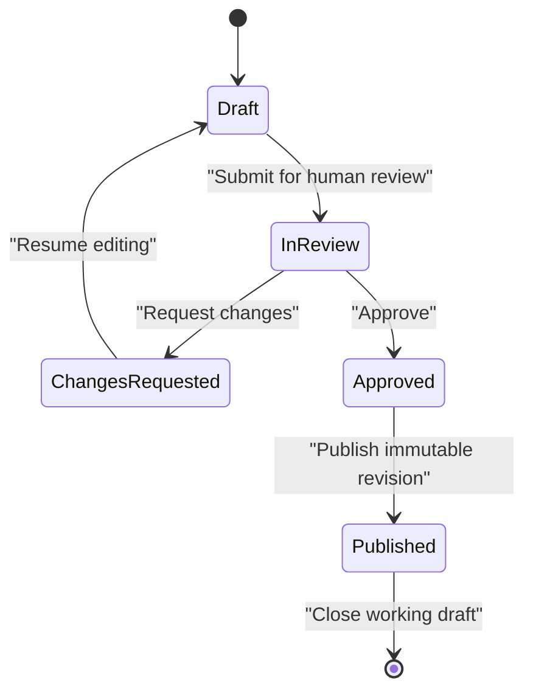
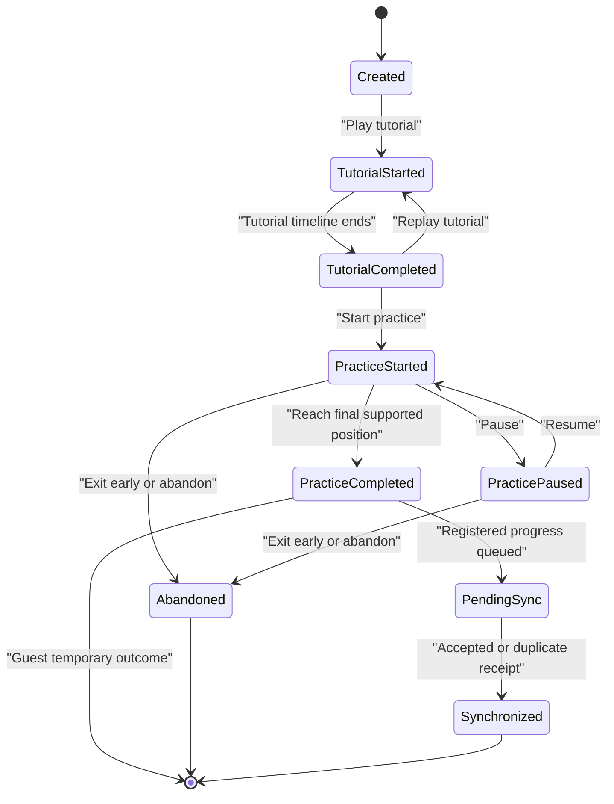
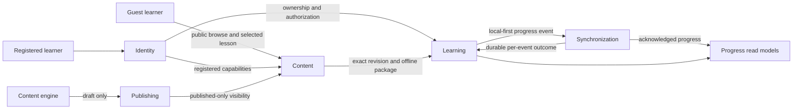
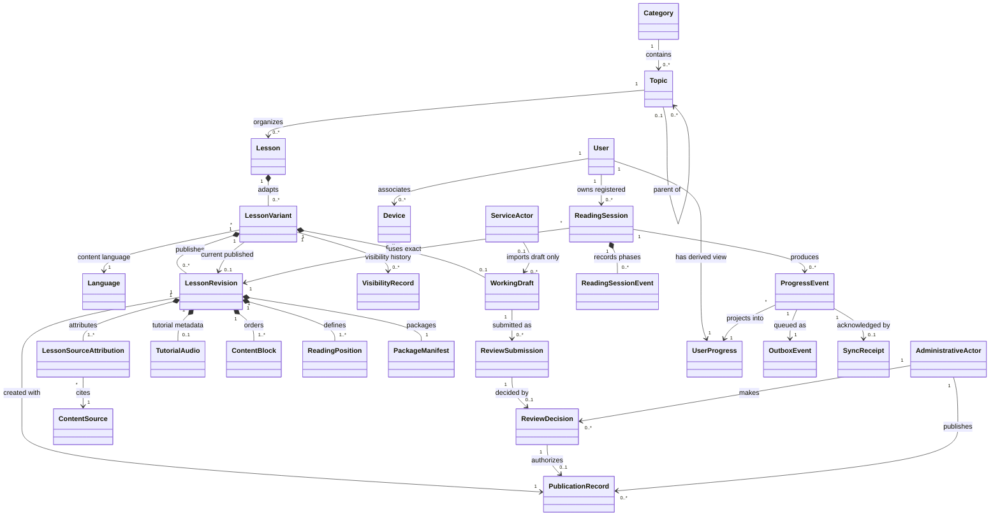

# Prolific Canonical Domain Model

| Item              | Value                                                                                                                                                                                                                               |
| ----------------- | ----------------------------------------------------------------------------------------------------------------------------------------------------------------------------------------------------------------------------------- |
| Status            | Draft for Architecture Gate Review                                                                                                                                                                                                  |
| Owner             | TBD                                                                                                                                                                                                                                 |
| Review date       | YYYY-MM-DD                                                                                                                                                                                                                          |
| Related PRD       | [Product Requirements Document](../01-product-vision/product-requirements-document.md)                                                                                                                                              |
| Related roadmap   | [Master Roadmap](../14-roadmap/master-roadmap.md)                                                                                                                                                                                   |
| Product decisions | [Product Decision Log](../product-decision-log.md)                                                                                                                                                                                  |
| Related ADRs      | [ADR-011](../decisions/ADR-011-mvp-product-access-and-reading-rules.md), [ADR-012](../decisions/ADR-012-use-prisma-for-core-api-persistence.md), and [ADR-013](../decisions/ADR-013-use-lesson-variants-and-immutable-revisions.md) |

## Purpose and authority

This document is the canonical conceptual model for Prolific. It defines domain language, identities, boundaries, invariants, relationships, events, and history requirements used to design APIs, databases, backend modules, Flutter models, offline storage, synchronization, and analytics. It is not a physical schema, API contract, or implementation design.

The [domain glossary](../02-requirements/domain-glossary.md) is the canonical short-form terminology reference. If either document changes a term, both must be reviewed together. Approved product behaviour comes from the PRD and Product Decision Log; this model may clarify structure but may not add product behaviour.

## Modelling conventions

| Classification     | Meaning                                                                                                     |
| ------------------ | ----------------------------------------------------------------------------------------------------------- |
| Core entity        | A long-lived concept with stable identity central to product behaviour.                                     |
| Supporting entity  | An identity-bearing concept that supports a core entity or workflow.                                        |
| Value object       | An immutable concept identified by its values rather than an independent ID.                                |
| Aggregate          | A consistency boundary whose root protects invariants for changes made together.                            |
| Aggregate member   | An entity or value owned and changed through an aggregate root.                                             |
| Domain event       | An immutable statement that a meaningful domain fact occurred. It does not imply a message broker.          |
| Read model         | A derived view optimized for display or query and rebuildable from authoritative data.                      |
| Transport contract | A request/response envelope crossing a process or device boundary; it is not automatically a domain entity. |

Conceptual entities do not map one-to-one to database tables. Physical persistence, API DTOs, and local models are derived later and require separate review.

## Domain areas

| Domain area         | Core concepts                               | Supporting concepts and classifications                                                                                                                                                                                                                           |
| ------------------- | ------------------------------------------- | ----------------------------------------------------------------------------------------------------------------------------------------------------------------------------------------------------------------------------------------------------------------- |
| Identity and Access | User                                        | Guest Session and Device support learner identity; Administrative Actor and Service Actor are separate authenticated security contexts, not learner subtypes.                                                                                                     |
| Content Taxonomy    | Language, Category, Topic                   | Language Tag and localized display name are value objects; taxonomy discovery is a read model.                                                                                                                                                                    |
| Learning Content    | Lesson                                      | Lesson Variant and Lesson Revision are identity-bearing members; Working Draft, Tutorial Audio metadata, and Lesson Source Attribution support the aggregate; Content Source is a supporting entity; Offline Lesson Package is a transport artifact/value object. |
| Learning Activity   | Reading Session                             | Reading Session Event is an aggregate member/domain fact; Progress Event is a domain/sync event; User Progress and Daily Streak are read models.                                                                                                                  |
| Synchronization     | None independently                          | Outbox Event is a durable local entity/envelope; Sync Request is a transport contract; Sync Receipt is a server-side supporting entity/transport result; Sync Cursor is a value object/transport checkpoint.                                                      |
| Publishing          | Working Draft and Lesson Revision lifecycle | Immutable Review Submissions/Decisions, Approval Evidence, Publication Records, and visibility records preserve the workflow around the Lesson aggregate.                                                                                                         |

## Identity and access model

The MVP recognizes three actor states:

- **Guest learner:** operates through a temporary Guest Session, not a permanent User. May use selected public published lessons and temporary current-session progress; may not download, retain or synchronize progress, maintain streaks, or use account history.
- **Registered learner:** represented by a User. May retain progress, maintain streaks, download published lessons, work offline, and synchronize.
- **Internal administrator:** a separately authorized internal actor. It is not a learner role and cannot be inferred from a learner account.

Parent, teacher, school, NGO, library, subscription, and payment roles are not part of the MVP. Child consent, recovery, exact privacy/legal deletion and retention policy, and administrator identity implementation remain unresolved; ADR-017 resolves the history-safe architecture boundary.

## Language model

Language has three distinct uses:

| Use                     | Definition                                                                                                                                                    |
| ----------------------- | ------------------------------------------------------------------------------------------------------------------------------------------------------------- |
| Interface language      | Language used for application navigation, controls, validation, and status messages.                                                                          |
| Lesson-content language | Exactly one Language assigned to a Lesson Variant and inherited by its Working Draft and Lesson Revisions.                                                    |
| Tutorial-audio language | Language spoken by the tutorial asset; it must match the associated Lesson Variant unless a future reviewed accessibility use case explicitly says otherwise. |

The MVP launch languages are English, isiZulu, and Sepedi. Flags must not represent languages. Not every lesson exists in every language. Easy, Medium, and Hard remain 100, 150, and 200 WPM; language-specific timing adjustments remain unresolved.

## Canonical core entities

### User

| Aspect                  | Canonical model                                                                                                                                                                           |
| ----------------------- | ----------------------------------------------------------------------------------------------------------------------------------------------------------------------------------------- |
| Definition              | A persistent registered learner identity that owns durable learner data and registered capabilities. A Guest Session is not a User.                                                       |
| Purpose                 | Own preferences, device associations, reading history, progress, streaks, downloads entitlement, and synchronization authorization.                                                       |
| Identity                | Stable UUID assigned at registration. It is not an email address, provider subject, device ID, or analytics identifier.                                                                   |
| Ownership               | The learner owns their private activity; platform administration governs the record under unresolved privacy and retention policy.                                                        |
| Lifecycle               | Created by registration; active; restricted/deactivated early after a verified deletion request; identifiers then anonymized, retained, or purged under approved policy/holds.            |
| State transitions       | Guest Session may lead to a new User without silent progress conversion. Deletion Request does not cascade; it drives verified deactivation, revocation, privacy treatment, and evidence. |
| Core attributes         | User ID, account state, created/updated UTC timestamps, and minimum authorization context. Credential data is outside the domain profile.                                                 |
| Mutable attributes      | Approved profile/preferences and account state under authorization.                                                                                                                       |
| Immutable attributes    | User ID and original creation timestamp.                                                                                                                                                  |
| Invariants              | A User is registered; guest analytics identity is not User identity; learner and internal administrator permissions are separate; private activity belongs to one User.                   |
| Business rules          | Registration is optional until account-only capability is requested. No paid, parent, teacher, NGO, library, classroom, or school role is inferred.                                       |
| Relationships           | May reference Devices and User Preferences; owns Reading Sessions, Progress Events, User Progress, and Daily Streak read models.                                                          |
| Commands/actions        | RegisterLearner, update preferences, associate Device, RequestAccountDeletion, DeactivateLearnerAccount, ApplyIdentityAnonymization, and permitted cancellation.                          |
| Domain events           | UserRegistered, AccountDeletionRequested, LearnerAccountDeactivated, IdentityAnonymized, PrivacyActionRecorded.                                                                           |
| Failure conditions      | Duplicate/conflicting registration, invalid consent, unauthorized profile access, invalid or expired credentials.                                                                         |
| Historical requirements | Retained activity detaches or pseudonymizes direct User linkage while preserving stable session/Revision meaning; user-facing history disappears after deletion.                          |
| Offline implications    | Deactivation revokes device/sync authority; late outbox replay cannot restore identity. Client treatment warns about pending events and follows approved local cleanup policy.            |
| Privacy implications    | Identity is separated from private activity where practical; direct identifiers are minimized; anonymization effectiveness and lawful retention require specialist approval.              |
| Unresolved decisions    | Provider/credentials, recovery, consent/safeguarding, exact retention/legal basis/timeframe, anonymization algorithm, backup expiry, and offline package cleanup.                         |

### Language

| Aspect                  | Canonical model                                                                                                                                   |
| ----------------------- | ------------------------------------------------------------------------------------------------------------------------------------------------- |
| Definition              | A supported human language used for interface localization, lesson content, or tutorial audio.                                                    |
| Purpose                 | Identify, filter, validate, and localize content without assuming equal inventories.                                                              |
| Identity                | Canonical BCP 47 language tag; internal UUID may be added physically without replacing the tag's semantic identity.                               |
| Ownership               | Platform-managed reference data.                                                                                                                  |
| Lifecycle               | Configured, made active for an approved use, and potentially retired from new discovery without rewriting history.                                |
| State transitions       | Inactive to active or active to inactive through authorized configuration; launch scope changes require product approval.                         |
| Core attributes         | Language tag, canonical name, localized display names, supported-use indicators.                                                                  |
| Mutable attributes      | Display names and active-use indicators.                                                                                                          |
| Immutable attributes    | Meaning of an issued language tag in historical Lesson Variants and Lesson Revisions.                                                             |
| Invariants              | A Lesson Variant has exactly one lesson-content Language; its revisions and tutorial audio use that language; flags are not language identifiers. |
| Business rules          | MVP content languages are English, isiZulu, and Sepedi; a lesson need not exist in all three.                                                     |
| Relationships           | Referenced by Lesson Variants and User Preferences; may filter Category/Topic discovery read models.                                              |
| Commands/actions        | ActivateLanguageUse, deactivate future discovery, update localized display name.                                                                  |
| Domain events           | LanguageUseActivated, LanguageUseDeactivated as candidate internal events if implementation needs them.                                           |
| Failure conditions      | Invalid/duplicate tag, unsupported use, missing localized label, mismatched tutorial-audio language.                                              |
| Historical requirements | Historical Lesson Revisions retain their Variant's exact language tag after language availability changes.                                        |
| Offline implications    | Language identity and display metadata required by a package must travel with or be resolvable from the offline package.                          |
| Privacy implications    | None intrinsically; a learner's language preference may be personal profile data.                                                                 |
| Unresolved decisions    | Interface-language launch coverage, canonical localized names, and language-specific pace/timing adjustments.                                     |

### Category

| Aspect                  | Canonical model                                                                                                                                                                                                                         |
| ----------------------- | --------------------------------------------------------------------------------------------------------------------------------------------------------------------------------------------------------------------------------------- |
| Definition              | Stable language-neutral top-level knowledge grouping containing Topics, never Lesson content directly.                                                                                                                                  |
| Identity/attributes     | Stable UUID; Canonical Taxonomy Name; localized names/descriptions; icon; explicit display order; `draft`/`active`/`hidden`/`archived`; UTC timestamps and archive metadata.                                                            |
| Naming                  | Active normalized canonical names are unique. Normalization is case-insensitive and whitespace-normalized; deterministic punctuation/diacritic details remain implementation work.                                                      |
| Lifecycle               | Draft preparation, active discovery eligibility, reversible hidden suppression, intentional archive, and audited restoration.                                                                                                           |
| Archive/restoration     | Archive makes every descendant path effectively unavailable without rewriting Topic states. Restore preserves identity/creation time, records actor/time/reason, revalidates uniqueness, and never activates descendants automatically. |
| Ordering/localization   | Order/icon/localized metadata are mutable presentation data; changes do not alter identity, create entities, or create Lesson Revisions.                                                                                                |
| Discovery eligibility   | State is active, an eligible Topic path exists, and it reaches a published learner-visible Revision for the browsing context.                                                                                                           |
| Historical requirements | Rename, hide, archive, restore, or reorder never breaks Topic, Lesson, Revision, Reading Session, or audit references. Hard delete/cascade is prohibited once referenced.                                                               |
| Commands/events         | CreateCategory, UpdateCategoryMetadata, HideCategory, ArchiveCategory, RestoreCategory with append-only actor/time/state/reason audit evidence.                                                                                         |
| Unresolved details      | Physical localization, exact normalization/collation, display-order allocation, projection refresh, and never-referenced draft purge.                                                                                                   |

### Topic

| Aspect                  | Canonical model                                                                                                                                                                                                |
| ----------------------- | -------------------------------------------------------------------------------------------------------------------------------------------------------------------------------------------------------------- |
| Definition              | Stable focused subject in exactly one Category, with zero or one Parent Topic and zero or more child Topics/Lessons.                                                                                           |
| Identity/attributes     | Stable UUID; Category ID; optional Parent Topic ID; Canonical Taxonomy Name; localized names/descriptions; sibling order; Category-compatible lifecycle/timestamps/archive metadata.                           |
| Hierarchy invariants    | Parent/child share Category; one parent maximum; self-parent/descendant cycles prohibited; authoritative parent graph is acyclic and finite; depth is not fixed.                                               |
| Naming                  | Active canonical names are unique within `Category + Parent Topic` sibling scope after case/whitespace normalization; names may repeat in other branches.                                                      |
| Reparenting             | Audited concurrency-checked move of complete subtree within the same Category; validates ancestry, cycle, destination uniqueness, and order atomically. Cross-Category moves are prohibited for MVP.           |
| Lifecycle/visibility    | Own states are `draft`/`active`/`hidden`/`archived`. Inactive ancestor causes Effective Visibility suppression without rewriting descendants. Restore requires eligible ancestors and uniqueness revalidation. |
| Discovery eligibility   | Own state, Category, and every ancestor are active, and self/descendant path reaches published content. Clients assume no fixed depth; MVP navigation normally uses at most three visible levels.              |
| Lesson reassignment     | Audited same-Category reassignment to active Topic preserves Lesson/Revision/Session identity and changes future discovery only. Cross-Category reassignment is deferred.                                      |
| Historical requirements | Rename, reorder, reparent, hide, archive, or restore never rewrites Lesson Revisions, Reading Sessions, or historical analytics. Normal retirement uses archive; destructive cascades are prohibited.          |
| Commands/events         | Create/Update/Reparent/Hide/Archive/Restore Topic and ReassignLessonToTopic with server actor, concurrency, reason, prior/resulting state, and append-only audit evidence.                                     |
| Unresolved details      | Ancestry optimization/query, normalization/collation, localization, order allocation, projection refresh, recommended product depth, and unused-draft purge.                                                   |

### Lesson

| Aspect                  | Canonical model                                                                                                                                                                                |
| ----------------------- | ---------------------------------------------------------------------------------------------------------------------------------------------------------------------------------------------- |
| Definition              | Stable educational identity of the smallest independently completable guided-reading unit, such as `The Pangolin`.                                                                             |
| Purpose                 | Group independently evolving language-and-difficulty Lesson Variants under one logical learning unit.                                                                                          |
| Identity                | Stable UUID that does not change when a variant is translated, adapted, revised, published, hidden, or archived.                                                                               |
| Ownership               | Learning Content domain; belongs to exactly one Topic.                                                                                                                                         |
| Lifecycle               | Created before or with its first Variant; survives Variant retirement/replacement; may be archived from discovery without destroying history.                                                  |
| Core attributes         | Lesson ID, Topic reference, creation/update timestamps, and stable educational metadata that is not learner-facing revision content.                                                           |
| Mutable attributes      | Topic assignment or stable metadata only through audited rules that preserve history. Learner-facing changes occur in a Variant's Working Draft and produce a new Lesson Revision.             |
| Immutable attributes    | Lesson ID and the identity of its historical Variant streams.                                                                                                                                  |
| Invariants              | Belongs to one Topic; does not directly contain learner-facing paragraph content; content engine cannot publish; archival preserves historical references.                                     |
| Business rules          | May have many Lesson Variants. Translation or difficulty adaptation creates/selects a Variant, while pace remains a Reading Session choice.                                                    |
| Relationships           | Aggregate root for Lesson Variants, their Working Drafts and Lesson Revisions, revision-level tutorial/source metadata, and lifecycle evidence. Reading Sessions reference an exact Revision.  |
| Commands/actions        | CreateLesson, CreateLessonVariant, create/update/submit/request-changes/approve a Working Draft, PublishLessonRevision, ArchiveLessonVariant.                                                  |
| Domain events           | LessonVariantCreated, LessonDraftCreated, LessonDraftUpdated, LessonDraftSubmittedForReview, LessonDraftChangesRequested, LessonDraftApproved, LessonRevisionPublished, LessonVariantArchived. |
| Failure conditions      | Missing Topic, duplicate active Variant, stale draft update, invalid lifecycle transition, incomplete source/assets, unauthorized publication, or mutation of a published Revision.            |
| Historical requirements | Retain every Revision referenced by activity, package, audit evidence, source attribution, checksum, and archive state.                                                                        |
| Offline implications    | A published Lesson Revision produces a complete verified Offline Lesson Package that identifies its Lesson and Variant and contains exact revision material.                                   |
| Privacy implications    | Content is not learner-private, but review actors and audit records may be internal personal data. Source rights and attribution must be protected.                                            |
| Unresolved decisions    | Tokenization/alignment, storage/delivery, audio format, image support, detailed review roles/audit persistence, translation lineage, and correction/withdrawal/expiry policy.                  |

#### Working Draft lifecycle

Approval and publication are separate. Only publication creates a learner-visible Lesson Revision. A correction starts or updates a new Working Draft; it never returns a published Revision to Draft.

#### Lesson Variant

Lesson Variant is the stable identity of one language-and-difficulty-specific adaptation, such as `The Pangolin — English — Beginner`.

| Element                    | Rule                                                                                                                      |
| -------------------------- | ------------------------------------------------------------------------------------------------------------------------- |
| Variant identity           | Stable UUID independent of its revisions.                                                                                 |
| Lesson reference           | Exactly one Lesson.                                                                                                       |
| Language                   | Exactly one lesson-content Language.                                                                                      |
| Difficulty                 | Exactly one of Beginner, Intermediate, or Advanced; it is not reading pace.                                               |
| Uniqueness                 | By default, one active Variant per `lesson_id + language_id + difficulty`; parallel editions require a later ADR.         |
| Lifecycle                  | May be active, hidden, or archived and may exist before any Revision is published.                                        |
| Working state              | Zero or one active Working Draft and zero or one Current Published Revision.                                              |
| History                    | Owns an independent monotonic Lesson Revision sequence; another language or difficulty stream does not share its numbers. |
| Translation/adaptation     | May record lineage to a source Revision, but lineage does not make the source and derived Revisions identical.            |
| Current published revision | Efficiently resolves the one Revision currently learner-visible for this Variant, if any.                                 |

#### Working Draft

Working Draft is the single editable working copy for one Lesson Variant in the MVP. Repeated saves update the same draft and do not consume revision numbers. Editing a published Variant creates the draft from its Current Published Revision. Edit commands carry an expected concurrency token; stale changes return a conflict, and silent last-write-wins is prohibited. Submission, changes requested, and approval update workflow state on the same draft. Successful publication closes or clears it.

The exact concurrency-token representation, persistence structure, and database locking strategy remain implementation details.

#### Lesson Revision

Lesson Revision is the immutable published snapshot of one Lesson Variant.

| Element               | Rule                                                                                                                                                    |
| --------------------- | ------------------------------------------------------------------------------------------------------------------------------------------------------- |
| Revision identity     | Stable UUID; checksum and human-readable number do not replace it.                                                                                      |
| Variant reference     | Exactly one Lesson Variant, which supplies one Lesson and its Language/Difficulty stream.                                                               |
| Revision number       | Positive integer scoped to the Variant. First publication is `1`; later publications increment by `1`; numbers are atomic, monotonic, and never reused. |
| Learner content       | Title, ordered structured Content Blocks, Revision-scoped Reading Units and Reading Positions, word count, and estimated reading time.                  |
| Provenance            | One or more Lesson Source Attributions referencing Content Sources. Attribution remains available offline.                                              |
| Integrity             | Canonical package inputs produce a SHA-256 Package Checksum; each binary asset has its own SHA-256 Asset Checksum. Neither checksum is identity.        |
| Tutorial              | Matching Tutorial Audio metadata and an Alignment Profile mapping its timeline to Reading Positions.                                                    |
| Review/publication    | Review state/evidence, publication state/timestamp, creator and reviewer references where approved.                                                     |
| Immutability          | Learner content, positions, attribution, audio metadata, checksum inputs, and package-relevant fields never change after publication.                   |
| Historical references | Reading Sessions, Offline Lesson Packages, and sync retries retain this exact Revision identity.                                                        |

Draft edits, rejected drafts, and abandoned drafts do not consume revision numbers. Publication atomically verifies the approved unchanged draft, allocates the next number, creates the Revision, switches Current Published Revision, records audit evidence, and closes the draft. Concurrent publication attempts cannot create duplicate numbers; only one succeeds and the loser reloads after a conflict.

### Reading Session

| Aspect                  | Canonical model                                                                                                                                                                                                                                                                      |
| ----------------------- | ------------------------------------------------------------------------------------------------------------------------------------------------------------------------------------------------------------------------------------------------------------------------------------ |
| Definition              | A learner's attempt to interact with one exact Lesson Revision through tutorial and practice activity.                                                                                                                                                                               |
| Purpose                 | Preserve the distinction between guided tutorial activity, independent practice, completion, progress, and synchronization.                                                                                                                                                          |
| Identity                | Client-generated UUID stable across offline persistence and synchronization retries for registered sessions; temporary unique ID for a guest session.                                                                                                                                |
| Ownership               | A registered session belongs to one User; a guest attempt belongs only to one temporary Guest Session and is not synchronized.                                                                                                                                                       |
| Lifecycle               | Created; tutorial starts/completes and may replay; practice starts, pauses/resumes, completes or is abandoned; registered progress becomes pending sync and then synchronized after acknowledgement. A tutorial-skip path is not approved by the current product baseline.           |
| State transitions       | `created` → `tutorial_started` → `tutorial_completed` → `practice_started` ↔ `practice_paused` → `practice_completed` or `abandoned`; tutorial replay returns through tutorial states without completing practice. Registered sync status progresses separately from learning phase. |
| Core attributes         | Session ID, exact Lesson Revision ID, Package Schema Version, Tokenization Profile/version, actor reference, selected pace preset and actual WPM, phase/state, final Reading Position, eligible units, practice elapsed time, UTC timestamps, completion/abandonment facts.          |
| Mutable attributes      | Current phase, position, active practice elapsed time, pause/resume data, completion fact, and registered synchronization status.                                                                                                                                                    |
| Immutable attributes    | Session ID, exact Lesson Revision reference, actor ownership, original creation time; recorded events are append-only facts.                                                                                                                                                         |
| Invariants              | Tutorial never completes the Lesson; completion requires practice to reach the final supported position without early exit; reading speed excludes tutorial time; guest attempts are not durable/synchronized; retries do not duplicate a session.                                   |
| Business rules          | Pause/resume is allowed; early exit is incomplete/abandoned; application audio is absent in practice; timestamps are UTC; streak qualification uses the applicable local calendar day.                                                                                               |
| Relationships           | References one Lesson Revision; Lesson/Variant data may be denormalized for reads but is not sufficient history. Contains Reading Session Events, produces Progress Events, and contributes to progress/streak read models.                                                          |
| Commands/actions        | StartReadingSession, PlayTutorial, ReplayTutorial, StartPractice, PausePractice, ResumePractice, CompletePractice, AbandonPractice.                                                                                                                                                  |
| Domain events           | TutorialStarted, TutorialCompleted, PracticeStarted, PracticePaused, PracticeResumed, PracticeCompleted, PracticeAbandoned, ReadingSessionCompleted, ProgressEventQueued.                                                                                                            |
| Failure conditions      | Unpublished/ineligible version, missing/corrupt package, invalid transition, mismatched final position, tutorial counted as practice, duplicate/conflicting event, storage failure.                                                                                                  |
| Historical requirements | Retain exact Lesson Revision, actual pace/WPM, practice time, event chronology, completion evidence, and sync provenance. Later Revisions do not alter historical word counts, speed, or analytics.                                                                                  |
| Offline implications    | Registered activity writes session/progress locally first and atomically enqueues an Outbox Event. Guest activity remains temporary.                                                                                                                                                 |
| Privacy implications    | Session activity is private learner data. Identity linkage must be detachable/pseudonymizable without changing session/Revision identity. Exact lawful retention, anonymization effectiveness, child safeguards, and export remain unresolved.                                       |
| Unresolved decisions    | Interruption/background tolerance, exact timing thresholds, repeated-attempt aggregation, local-day timezone policy, multi-device reconciliation, retention.                                                                                                                         |

#### Reading Session phases

Learning phase and synchronization state may be modelled as orthogonal state dimensions in implementation. The combined diagram communicates the journey without requiring one persistence enum.

## Supporting domain concepts

| Concept                   | Classification                                      | Definition and reason                                                                                                                                                                    |
| ------------------------- | --------------------------------------------------- | ---------------------------------------------------------------------------------------------------------------------------------------------------------------------------------------- |
| Guest Session             | Supporting entity                                   | Temporary non-account identity for public trial and current-session state. It has continuity inside a session but no durable learner ownership or sync entitlement.                      |
| Device                    | Supporting entity                                   | Pseudonymous registered installation association used for authorization/session context and sync provenance; it is not hardware identity or a User.                                      |
| User Preferences          | User aggregate member/value set                     | Validated learner settings such as interface language, content language, pace, and accessibility preferences; no independent business lifecycle is approved.                             |
| Administrative Actor      | Separate authenticated human actor                  | Deactivation revokes current capability but preserves stable/pseudonymous historical review/publication evidence; mutable profile data may be minimized.                                 |
| Service Actor             | Separate authenticated non-human actor              | Disabled or rotated rather than erased; stable historical attribution remains, secrets never enter audit, and it cannot satisfy human review/publication authority.                      |
| Account Deletion Request  | Privacy workflow concept                            | Verified request tracked independently from immediate database deletion; may be requested, pending, blocked, completed, failed, or cancelled if later policy permits.                    |
| Retention Hold            | Privacy/governance control                          | Prevents purge for an approved legal, security, fraud, audit, or operational reason; it does not make data learner-visible.                                                              |
| Privacy Action Record     | Restricted append-only evidence                     | Minimal evidence of request, deactivation, anonymization, hold/release, or purge; excludes copied profiles, credentials, and private activity.                                           |
| Tutorial Audio            | Lesson Revision member metadata plus external asset | Revision-matched local-playable tutorial asset metadata; binary storage is infrastructure, while language, checksum/reference, duration, and alignment relationship are domain-relevant. |
| Content Block             | Lesson Revision member/value object                 | Stable-ID, ordered `heading`, `paragraph`, `callout`, `fact`, or `quote` block containing exact Canonical Display Text and a readable flag.                                              |
| Reading Unit              | Lesson Revision member/value object                 | Word-oriented unit derived deterministically from one Content Block by its Tokenization Profile; whitespace is not a unit.                                                               |
| Reading Position          | Lesson Revision member/value object                 | Zero-based contiguous Revision-scoped index identifying one Reading Unit and its block-relative half-open Display Span.                                                                  |
| Tokenization Profile      | Versioned interpretation rule set                   | Language-aware deterministic rules that derive Reading Units, Normalized Comparison Text, positions, and word count without changing display text.                                       |
| Alignment Profile         | Versioned interpretation rule set                   | Mapping between tutorial-audio timeline points and Reading Positions for the same Revision.                                                                                              |
| Content Source            | Supporting entity                                   | Stable description of an origin used to substantiate content, such as a publication or reviewed reference.                                                                               |
| Lesson Source Attribution | Lesson Revision member/value object                 | The contextual link from a Lesson Revision to a Content Source, including citation/rights details needed for that immutable use.                                                         |
| Package Manifest          | Lesson Revision value object                        | Canonical package identity, schema/profile versions, ordered asset descriptors, SHA-256 integrity values, and interpretation metadata.                                                   |
| Package Schema Version    | Package value object                                | Positive integer selecting the package interpretation contract; independent from Revision Number and event/API schema versions.                                                          |
| Package Checksum          | Lesson Revision/package value object                | `sha256:` integrity value over canonical semantic package inputs; not Revision identity or a transport locator.                                                                          |
| Asset Checksum            | Package asset value object                          | `sha256:` integrity value over exact asset bytes, verified separately from the Package Checksum.                                                                                         |
| Offline Lesson Package    | Value object and transport artifact                 | Complete immutable learner artifact for one published Lesson Revision as defined by the Package Manifest; operational and learner-state data is excluded.                                |
| Reading Session Event     | Aggregate member/domain fact                        | Append-only phase or position fact inside one Reading Session used to establish chronology and completion evidence.                                                                      |
| Progress Event            | Domain event and sync payload                       | Immutable learner-progress fact produced from registered activity and eligible for outbox transfer. It is not the Reading Session itself.                                                |
| User Progress             | Read model                                          | Derived registered-learner summary of lessons completed, total practice reading time, words read, and recent sessions.                                                                   |
| Daily Streak              | Read model/value                                    | Derived current/longest consecutive local-day qualification; it is not an achievement system.                                                                                            |
| Outbox Event              | Local supporting entity/transport envelope          | Durable local record containing an immutable Progress Event, stable event ID, retry metadata, and acknowledgement state.                                                                 |
| Sync Request              | Transport contract                                  | Batch envelope transferring one or more immutable outbox payloads; not an aggregate.                                                                                                     |
| Sync Receipt              | Supporting entity and transport result              | Durable server evidence of the outcome for one event ID, enabling idempotent accepted/duplicate/rejected/retryable responses.                                                            |
| Sync Cursor               | Value object/transport checkpoint                   | Opaque checkpoint for incremental reconciliation; its lifecycle is unresolved.                                                                                                           |
| Review Submission         | Immutable Lesson aggregate audit record             | Exact Working Draft state submitted for human review, including submitter, version token, content/source checksums, time, and status.                                                    |
| Review Decision           | Immutable Lesson aggregate audit record             | Human `changes_requested`, `approved`, `rejected`, or permitted `withdrawn` decision against one exact Review Submission.                                                                |
| Approval Evidence         | Value object/evidentiary relationship               | Approved Review Decision plus exact submission/checksums, actor, time, and authorization-at-decision evidence; never learner visibility by itself.                                       |
| Publication Record        | Immutable Lesson aggregate audit record             | Transactional evidence linking exact approval, publishing actor, checksums, and one newly learner-visible Lesson Revision.                                                               |
| Archive/Withdrawal Record | Immutable visibility/audit record                   | Append-only authorized change to discovery/visibility that preserves the prior state, reason, exact target, and original publication/history.                                            |
| Superseding Record        | Immutable corrective audit relationship             | New record that corrects or compensates for erroneous evidence without editing or deleting the original.                                                                                 |

## Aggregate boundaries and consistency

### User aggregate

**Root:** User. **Potential members:** User Preferences and registered Device references. Registration and preference/device association changes require immediate consistency within the aggregate. Reading history, progress summaries, and sessions reference User but are separate aggregates/read models to avoid an ever-growing User transaction.

### Lesson aggregate

**Root:** Lesson. **Identity-bearing members:** Lesson Variants and Lesson Revisions. **Working members:** at most one Working Draft per Variant, plus Revision-level Content Blocks, Reading Units, Reading Positions, Package Manifest, Tutorial Audio metadata, and Lesson Source Attributions. Variant uniqueness, one active draft, deterministic Revision material, optimistic concurrency, atomic publication numbering/current-revision switching, and immutable Revision history require immediate consistency. Binary assets and Content Source master records may live outside the aggregate; stable references and checksums must be valid before publication.

Typed Review Submissions, Review Decisions, Publication Records, and visibility records preserve the Lesson aggregate's append-only editorial chronology. Current Working Draft/workflow and visibility state may support efficient commands and reads, but must remain consistent with that evidence.

### Publishing and administrative identity boundaries

Publishing owns submission, human decision, approval evidence, publication, and later visibility actions. Identity/authorization owns Administrative Actor and Service Actor authentication and current capability assignments. Publishing stores stable actor references and minimal authorized snapshots, not mutable identity profiles or credentials. Editorial actions never grant access to learner activity, and Service Actors cannot approve or publish.

### Reading aggregate

**Root:** Reading Session. **Potential members:** Reading Session Events. Completion and local creation of its Progress Event must be failure-safe. The Outbox Event is a local synchronization concern linked by stable IDs; a local transaction may persist session progress and outbox state atomically without making them one conceptual aggregate.

### Taxonomy aggregates

Language and Category have independent identities. A Topic belongs to one Category taxonomy boundary; create, reparent, archive, and restore operations require immediate same-Category, acyclicity, scoped-name, lifecycle, and concurrency consistency. Lesson references one Topic but does not become a Category aggregate member. Discovery eligibility and ancestry paths may be eventually consistent projections, but they are never hierarchy authority.

### Eventual consistency boundaries

User Progress, Daily Streak, discovery catalogs, analytics, and synchronized server summaries may be updated from authoritative events. They must never be treated as the source for immutable Reading Session facts, publication state, or idempotency receipts.

## Domain events

| Event                         | Meaning and producer                                                                       | Consumers                                              | Kind                                                            | Idempotency expectation                                               |
| ----------------------------- | ------------------------------------------------------------------------------------------ | ------------------------------------------------------ | --------------------------------------------------------------- | --------------------------------------------------------------------- |
| UserRegistered                | A persistent learner account was created; Identity produces it.                            | Preferences, authorization, analytics under consent.   | Internal domain event.                                          | One fact per User ID; duplicate handling is safe.                     |
| AccountDeletionRequested      | A verified deletion workflow was requested.                                                | Identity, privacy workflow, device/sync authorization. | Restricted internal privacy event.                              | Stable request ID prevents duplicate workflows.                       |
| LearnerAccountDeactivated     | New account use and sync authority were disabled.                                          | Authentication, Devices, synchronization.              | Restricted internal privacy event.                              | Expected account state makes retries safe.                            |
| IdentityAnonymized            | Approved direct identifiers/linkages were irreversibly treated.                            | Privacy evidence and restricted projections.           | Restricted internal privacy event.                              | Stable action/policy version prevents duplicate treatment.            |
| RetentionHoldChanged          | An authorized hold was placed or released.                                                 | Privacy workflow and purge eligibility.                | Restricted internal governance event.                           | Stable hold ID and expected state.                                    |
| PrivacyActionRecorded         | Minimal append-only evidence of a privacy action was committed.                            | Restricted audit and compliance operations.            | Restricted internal audit event.                                | Stable action ID; corrections supersede.                              |
| CategoryCreated               | An authorized actor created a stable Category identity.                                    | Taxonomy audit and discovery projections.              | Internal domain event.                                          | Stable command and Category IDs prevent duplicates.                   |
| CategoryMetadataUpdated       | A Category name, localization, icon, or order changed.                                     | Taxonomy audit and discovery projections.              | Internal domain event.                                          | Expected version rejects stale updates.                               |
| CategoryVisibilityChanged     | A Category was hidden, archived, or restored.                                              | Taxonomy audit, catalog, and eligibility projections.  | Internal domain event.                                          | Stable command ID and expected state make retries safe.               |
| TopicCreated                  | A Topic was created under one Category and optional parent Topic.                          | Taxonomy audit and discovery projections.              | Internal domain event.                                          | Stable command and Topic IDs prevent duplicates.                      |
| TopicMetadataUpdated          | A Topic name, localization, or order changed.                                              | Taxonomy audit and discovery projections.              | Internal domain event.                                          | Expected version rejects stale updates.                               |
| TopicReparented               | A Topic subtree moved to another parent in the same Category.                              | Taxonomy audit, ancestry, and catalog projections.     | Internal domain event.                                          | Stable command ID and expected hierarchy version prevent replay.      |
| TopicVisibilityChanged        | A Topic was hidden, archived, or restored.                                                 | Taxonomy audit, catalog, and eligibility projections.  | Internal domain event.                                          | Stable command ID and expected state make retries safe.               |
| LessonReassignedToTopic       | A Lesson moved to another active Topic in the same Category.                               | Taxonomy audit and discovery projections.              | Internal domain event.                                          | Expected Lesson version rejects stale reassignment.                   |
| LessonVariantCreated          | A unique language/difficulty Variant was created for a Lesson.                             | Publishing workflow, catalog preparation, audit.       | Internal domain event.                                          | Stable Variant ID and uniqueness prevent duplicate active streams.    |
| LessonDraftCreated            | A Variant received its one active Working Draft.                                           | Editorial workflow and audit.                          | Internal domain event.                                          | Repeated command returns the existing compatible draft or conflicts.  |
| LessonDraftUpdated            | A concurrency-checked edit changed the Working Draft.                                      | Editorial workflow and audit.                          | Internal domain event.                                          | Stable command ID/token prevents duplicate or stale mutation.         |
| LessonDraftSubmittedForReview | An eligible Working Draft entered review.                                                  | Publishing workflow and audit.                         | Internal domain event.                                          | Repeated command must not create duplicate active review transitions. |
| LessonDraftChangesRequested   | A reviewer returned the same Working Draft for correction.                                 | Editorial workflow and audit.                          | Internal domain event.                                          | Stable transition/audit ID; duplicate is a no-op.                     |
| LessonDraftRejected           | A reviewer rejected one exact Review Submission.                                           | Editorial workflow and audit.                          | Internal domain event.                                          | Stable Review Decision ID prevents duplication.                       |
| LessonDraftApproved           | Human review passed for the unchanged Working Draft.                                       | Publication workflow and audit.                        | Internal domain event.                                          | Stable transition/audit ID; duplicate is a no-op.                     |
| LessonRevisionPublished       | Publication atomically created and exposed one immutable Lesson Revision.                  | Catalog, package delivery, cache invalidation.         | Internal domain event.                                          | One fact per Revision; concurrent attempts cannot duplicate numbers.  |
| LessonVariantArchived         | A Variant left new discovery while its Revisions remained historical.                      | Catalog, reporting, package policy.                    | Internal domain event.                                          | Repeated archive command is safe.                                     |
| LessonRevisionWithdrawn       | A published Revision was removed from discovery by an authorized compensating action.      | Catalog, audit, package policy.                        | Internal domain event.                                          | Stable visibility-record ID prevents duplicate action.                |
| LessonPublicationRestored     | A permitted compensating action restored publication visibility without rewriting history. | Catalog and audit.                                     | Internal domain event.                                          | Stable visibility-record ID prevents duplication.                     |
| AdministrativeRoleChanged     | Current internal capabilities changed without rewriting historical action evidence.        | Authorization and restricted audit.                    | Identity/authorization domain event.                            | Stable role-change ID required.                                       |
| ServiceDraftImported          | An authorized Service Actor created or updated draft material within draft-only scope.     | Publishing workflow and audit.                         | Internal domain event.                                          | Stable import/command ID prevents duplicate materialization.          |
| TutorialStarted               | Tutorial began for a session; Learning produces it.                                        | Session history, limited analytics.                    | Internal/local domain event; sync only if contract includes it. | Unique event ID if synchronized.                                      |
| TutorialCompleted             | Tutorial timeline ended; Learning produces it.                                             | Session history and tutorial metrics only.             | Internal/local domain event; never completion.                  | Duplicate cannot change Lesson completion.                            |
| PracticeStarted               | Independent practice began; Learning produces it.                                          | Session state, progress timing.                        | Internal/local domain event; sync candidate.                    | Stable session/event IDs.                                             |
| PracticePaused                | Active practice paused; Learning produces it.                                              | Session state and elapsed-time calculation.            | Internal/local domain event.                                    | Duplicate must not double-count time.                                 |
| PracticeResumed               | Paused practice resumed; Learning produces it.                                             | Session state and elapsed-time calculation.            | Internal/local domain event.                                    | Duplicate must not create concurrent active intervals.                |
| PracticeCompleted             | Eligible practice reached the final position; Learning produces it.                        | Session completion, progress, streak.                  | Internal domain event and source for sync event.                | Exactly one effective completion per session.                         |
| PracticeAbandoned             | Attempt ended before completion; Learning produces it.                                     | History and recovery presentation.                     | Internal/local domain event.                                    | Repeated abandonment is a no-op.                                      |
| ReadingSessionCompleted       | Reading Session became complete from PracticeCompleted; Learning produces it.              | User Progress and analytics.                           | Internal domain event.                                          | One effective fact per session.                                       |
| ProgressEventQueued           | Immutable Progress Event entered local outbox; Learning/local persistence produces it.     | Synchronization.                                       | Local domain event.                                             | Stable event ID reused for every retry.                               |
| ProgressEventAccepted         | Server durably accepted a new event; Synchronization produces it.                          | Outbox, server progress read models.                   | Sync outcome/internal domain event.                             | Same ID/payload returns the same effective outcome.                   |
| ProgressEventRejected         | Server permanently rejected an event; Synchronization produces it.                         | Outbox recovery and diagnostics.                       | Sync outcome/internal domain event.                             | Reprocessing cannot mutate the original receipt.                      |
| DailyStreakUpdated            | Derived streak changed after qualifying completion; Progress projection produces it.       | Progress UI and analytics.                             | Read-model event.                                               | Rebuilding from the same accepted facts yields the same result.       |

These are candidate event names and meanings, not a requirement for a broker, event-sourced persistence, or one physical event table. A Progress Event crossing the sync boundary requires a unique ID; purely internal events may use in-process dispatch or direct projection updates.

## Canonical invariants

1. A Guest Session must not permanently save or synchronize learner progress.
2. A guest must not download a lesson for offline use.
3. Learner discovery and lesson APIs must never return an unpublished Lesson Revision.
4. A published Lesson Revision must never be silently overwritten or edited in place.
5. Tutorial completion or replay must never complete a Lesson or Reading Session.
6. A completed Reading Session must reference one exact Lesson Revision and valid final position.
7. Reading speed and practice elapsed time must exclude tutorial time.
8. The same synchronization event ID and payload must not be processed twice into duplicate outcomes or sessions.
9. The content scripting engine must never approve or publish directly.
10. Archive or deletion operations must not destroy historical Reading Session references.
11. A Lesson Variant belongs to exactly one Language and one Difficulty; active Variant uniqueness is scoped to Lesson, Language, and Difficulty.
12. Difficulty belongs to the Lesson Variant; reading pace belongs to the Reading Session, and the two are separate concepts.
13. Source attribution must remain associated with published content and available in its Offline Lesson Package.
14. A Topic belongs to exactly one Category and its optional parent hierarchy must be acyclic.
15. Published content must have passed human review; `approved` and `published` are distinct states.
16. Registered progress is written locally before synchronization and is removed from the outbox only after durable acknowledgement.
17. Each Lesson Variant has at most one active Working Draft and zero or one Current Published Revision.
18. Revision numbers are positive, Variant-scoped, monotonically allocated at publication, unique per Variant, and never consumed by draft saves or reused.
19. Publication uses optimistic concurrency and one atomic transaction; a stale or losing concurrent attempt returns a conflict and creates no partial Revision.
20. Content Blocks have stable IDs and deterministic order; every readable block is represented by the Revision's position sequence.
21. Reading Positions are zero-based, contiguous, Revision-scoped, and point to exactly one Reading Unit and one valid block-relative half-open Display Span.
22. Canonical Display Text is preserved exactly; Normalized Comparison Text is derived and must never replace learner-visible text.
23. Word count equals the number of eligible Reading Units produced by the recorded Tokenization Profile and version.
24. Tutorial alignment and silent practice use the same Reading Positions; practice progression never depends on audio playback.
25. A Package Checksum is SHA-256 over the canonical semantic package inputs defined by ADR-014; rebuilding identical inputs reproduces the same checksum.
26. An Offline Lesson Package contains immutable learner content and integrity/interpretation metadata only; progress, credentials, analytics, preferences, temporary URLs, and device state are excluded.
27. Administrative Actors, Service Actors, system processes, and learner Users remain distinguishable; request bodies never establish trusted audit identity.
28. Review Submissions, Review Decisions, Publication Records, and visibility records are append-only; corrections use superseding or compensating records.
29. Approval applies only to one exact submitted content/source integrity state and never makes content learner-visible.
30. Publication atomically creates exactly one Lesson Revision and Publication Record from an authorized approved unchanged submission; failure creates neither.
31. The default separation-of-duties policy denies author self-approval; any configured exception is explicit and audited.
32. Service Actors, including the Content Engine, never approve human review or publish learner-visible content.
33. Archive, withdrawal, restoration, actor deactivation, or destructive account operations never erase editorial or historical Reading Session evidence.
34. A Topic belongs to exactly one Category, has at most one parent Topic, and any parent belongs to the same Category without creating a cycle.
35. Active Category canonical names are normalized-unique; active Topic canonical names are normalized-unique among siblings within one Category.
36. Subtree reparenting is same-Category only and transactionally validates the destination, cycle freedom, scoped name, lifecycle, and expected hierarchy version.
37. A hidden or archived ancestor makes descendants effectively unavailable without rewriting descendant lifecycle states; restoration re-evaluates each descendant's own state and ancestors.
38. Taxonomy renames, reordering, reparenting, lifecycle changes, and Lesson reassignment do not rewrite Lesson Revision, Reading Session, progress, or audit history.
39. Referenced Categories and Topics are retired through lifecycle state; destructive cascades and hard deletion are prohibited.
40. Deactivation, archive, withdrawal, anonymization, pseudonymization, retention, Retention Hold, and purge remain distinct operations.
41. No cascade delete crosses an aggregate boundary or destroys immutable Lesson, Reading Session, synchronization, editorial, taxonomy, actor, or privacy history.
42. Learner identity linkage can be removed or replaced from lawfully retained activity without changing Reading Session or Lesson Revision identity.
43. A deleted/deactivated account and its Devices cannot submit late events that recreate the account or reattach anonymized activity.
44. Privacy Action Records are append-only, access-restricted, data-minimized, and excluded from learner APIs and Offline Lesson Packages.
45. Purge applies only to approved non-historical data after dependency, review/audit, and Retention Hold checks.

## Commands and use cases

| Use case                      | Actor                                          | Preconditions                                                             | Result and major invariant protected                                             |
| ----------------------------- | ---------------------------------------------- | ------------------------------------------------------------------------- | -------------------------------------------------------------------------------- |
| BrowsePublishedCategories     | Guest or registered learner                    | Online public catalog available.                                          | Active Categories backed by published content; unpublished content excluded.     |
| BrowsePublishedTopics         | Guest or registered learner                    | Eligible Category/language filter.                                        | Active Topics backed by published content; taxonomy integrity protected.         |
| BrowsePublishedLessons        | Guest or registered learner                    | Eligible Topic/language; access mode known.                               | Guest limited free or registered complete eligible published catalog.            |
| StartGuestLesson              | Guest                                          | Selected public free published Revision; no download required.            | Temporary Guest Session/Reading Session; no durable progress or sync.            |
| RegisterLearner               | Guest/person                                   | Approved registration and consent inputs.                                 | New User; no paid/role assumptions; guest identity not silently merged.          |
| RequestAccountDeletion        | Registered learner or authorized privacy actor | Verified identity/authority and no duplicate active request.              | Restricted/deactivated workflow begins without destructive cascade.              |
| DeactivateLearnerAccount      | Privacy workflow                               | Verified request and expected active state.                               | Credentials/devices/sync authority revoked; minimal evidence recorded.           |
| ApplyIdentityAnonymization    | Authorized privacy workflow                    | Holds checked; approved policy/version; treatment plan complete.          | Direct identifiers treated consistently; retained history remains meaningful.    |
| PlaceOrReleaseRetentionHold   | Authorized privacy/security actor              | Valid purpose, scope, authority, and expected state.                      | Purge eligibility changes with restricted append-only evidence.                  |
| PurgeEligibleDraftData        | Authorized controlled workflow                 | Never published/referenced/review-required; no hold.                      | Only temporary data removed; purge evidence retained.                            |
| DeactivateAdministrativeActor | Authorized identity administrator              | Actor and historical references identified.                               | Current access revoked; editorial evidence remains attributable.                 |
| DisableServiceActor           | Authorized identity administrator              | Service and credentials identified.                                       | Credentials disabled/rotated; service audit history remains.                     |
| DownloadLessonPackage         | Registered learner                             | Authorized, online, published Revision, sufficient storage.               | Verified exact-Revision package; guest restriction and integrity protected.      |
| AssembleRevisionPackage       | Publishing application service                 | Complete approved Revision material and verified external assets.         | Deterministic manifest/package and checksums without network-operational state.  |
| VerifyRevisionPackage         | Mobile application                             | Complete transferred package and supported schema/block/profile versions. | Package/assets verified before atomic local promotion.                           |
| StartReadingSession           | Guest or registered learner                    | Eligible exact Revision/package and selected pace.                        | New session tied to one Revision and actor state.                                |
| PlayTutorial                  | Learner                                        | Tutorial asset matches Revision.                                          | Tutorial phase begins; no practice/completion.                                   |
| ReplayTutorial                | Learner                                        | Tutorial replay permitted.                                                | Tutorial restarts coherently; no practice/completion.                            |
| StartPractice                 | Learner                                        | Valid session/Revision and pace.                                          | Application-silent practice timing begins.                                       |
| PausePractice                 | Learner                                        | Practice active.                                                          | Position and active time persist without completion.                             |
| ResumePractice                | Learner                                        | Practice paused and resumable.                                            | Same session resumes without double-counted time.                                |
| CompletePractice              | Learner                                        | Practice reached final supported position without abandonment.            | Session completion/progress fact; tutorial excluded.                             |
| AbandonPractice               | Learner                                        | Practice incomplete or exited early.                                      | Incomplete attempt retained as permitted; no false completion.                   |
| QueueProgressEvent            | Registered learner/application                 | Durable local session/progress change.                                    | Stable immutable event and outbox record; atomicity protected.                   |
| SynchronizeOutbox             | Registered learner/application                 | Valid session/connectivity; pending events.                               | Per-event accepted/duplicate/rejected/retryable receipts; idempotency protected. |
| CreateCategory                | Authorized taxonomy administrator              | Canonical name passes normalization and active uniqueness.                | Stable draft or active Category and append-only audit evidence.                  |
| UpdateCategoryMetadata        | Authorized taxonomy administrator              | Category exists; expected version and scoped name are valid.              | Metadata/order changes without identity or history rewrite.                      |
| HideOrArchiveCategory         | Authorized taxonomy administrator              | Category exists; impact and reason identified.                            | Effective descendant unavailability without child-state mutation.                |
| RestoreCategory               | Authorized taxonomy administrator              | Category exists and restoration passes current rules.                     | Category returns to its requested state; descendants are re-evaluated.           |
| CreateTopic                   | Authorized taxonomy administrator              | Category and optional same-Category parent exist; name is sibling-unique. | Stable Topic identity without a cycle.                                           |
| UpdateTopicMetadata           | Authorized taxonomy administrator              | Topic exists; expected version and scoped name are valid.                 | Metadata/order changes without identity or history rewrite.                      |
| ReparentTopic                 | Authorized taxonomy administrator              | Same-Category destination; expected version; no cycle or name conflict.   | Whole subtree moves atomically; history remains unchanged.                       |
| HideArchiveOrRestoreTopic     | Authorized taxonomy administrator              | Topic exists; transition, reason, and expected version are valid.         | Own state changes; descendant effective visibility is derived.                   |
| ReassignLessonToTopic         | Authorized taxonomy administrator              | Lesson and active destination Topic share one Category.                   | Future discovery changes; published and reading history remains unchanged.       |
| CreateLesson                  | Authorized content actor                       | Valid Topic and stable educational identity.                              | New Lesson identity without learner-facing content.                              |
| CreateLessonVariant           | Authorized content actor                       | Lesson, Language, Difficulty; no active duplicate.                        | New independent adaptation stream.                                               |
| CreateOrUpdateLessonDraft     | Content editor or draft-only content engine    | Variant exists; expected token matches for updates.                       | One editable Working Draft; saves consume no revision number.                    |
| SubmitLessonDraftForReview    | Authorized content actor                       | Valid complete draft and matching token.                                  | Same draft enters `in_review`; review evidence begins.                           |
| RequestLessonDraftChanges     | Authorized human reviewer                      | Draft is `in_review`.                                                     | Same draft records `changes_requested` and returns to editable flow.             |
| RejectLessonDraft             | Authorized human reviewer                      | Exact Review Submission is current and unchanged.                         | Immutable rejected Review Decision; no learner visibility.                       |
| ApproveLessonDraft            | Authorized human reviewer                      | Unchanged draft in review passes criteria.                                | Draft becomes `approved`, not learner-visible.                                   |
| PublishLessonRevision         | Authorized internal administrator              | Approved unchanged draft and complete assets.                             | Atomic next Revision creation/current switch; engine cannot invoke directly.     |
| ArchiveLessonVariant          | Authorized internal administrator              | Variant and historical impact identified.                                 | Variant leaves new discovery; Revision/session history remains.                  |
| WithdrawLessonRevision        | Authorized Publisher                           | Exact published Revision and reason identified.                           | Append-only withdrawal record changes discovery without mutating Revision.       |
| RestoreLessonPublication      | Authorized Publisher                           | Restoration is permitted and prior visibility evidence exists.            | Append-only restoration record; original publication time/history unchanged.     |

## Bounded-context interactions

- **Identity** controls account ownership and registered capabilities; guest browsing does not require a permanent User.
- **Publishing** controls Working Draft review, approval, Lesson Revision publication, and Variant archive; Content exposes only published Revisions.
- **Content** supplies taxonomy, exact Lesson Revisions, and complete offline packages.
- **Learning** owns Reading Sessions and creates local progress facts.
- **Synchronization** transfers immutable registered Progress Events and returns durable idempotent outcomes.

## Conceptual domain relationship diagram

Guest Session, Daily Streak, Offline Lesson Package, Sync Request, and Sync Cursor are intentionally omitted from this entity-focused view because they are temporary actor context, derived read model, transport artifact, or value/transport contract rather than core persistent domain entities. Actor capability assignments and Approval Evidence are omitted because their physical representation remains controlled design work or is derivable from typed records.

## Historical data and privacy rules

- Historical Reading Sessions retain exact Lesson Revision identity, its Lesson Variant Language/Difficulty, actual pace, positions, word count, practice timing, completion, and event/sync provenance. Later Revisions never rewrite those facts.
- Taxonomy/content archival removes new discovery but does not break historical references.
- Published source attribution and review/publication evidence remain auditable.
- Editorial evidence uses stable actor IDs and minimal permitted snapshots; role/profile changes or deactivation never rewrite recorded actions.
- Internal review notes are restricted sensitive administrative data, excluded from learner APIs/packages, and separately classified from learner activity.
- Administrative editorial capabilities do not automatically authorize access to private learner activity.
- User activity, Device associations, progress, streaks, and sync metadata are private learner data.
- Guest analytics use non-identifying session/device identifiers and are not silently merged with User identity.
- Child consent, deletion, retention, anonymization, recovery, export, analytics retention, and administrator audit retention require dedicated approval.

## Unresolved architecture and policy decisions

- Flutter state-management and local-database packages.
- Physical aggregate mapping and Prisma schema conventions. Prisma ORM, Prisma Migrate, explicit repository interfaces with Prisma adapters, and application-service transaction ownership are approved by [ADR-012](../decisions/ADR-012-use-prisma-for-core-api-persistence.md).
- Object/file storage and package delivery.
- Authentication provider/credentials, recovery, offline expiry, and exact physical identity/activity mapping. History-safe deletion/anonymization, non-destructive references, and the retention framework are approved by [ADR-017](../decisions/ADR-017-use-history-safe-deletion-and-anonymization.md); exact policy/implementation remain open.
- Exact Language-specific Tokenization Profile rules/test corpora and tutorial-alignment generation method; the profile, versioning, and Reading Position boundaries are approved by [ADR-014](../decisions/ADR-014-use-structured-content-blocks-and-revision-packages.md).
- Language-specific pace/timing adjustments.
- Exact Working Draft concurrency-token representation, locking/allocation strategy, persistence structure, and translation-lineage mapping. Lesson/Variant/Revision responsibilities and Variant-scoped numbering are approved by [ADR-013](../decisions/ADR-013-use-lesson-variants-and-immutable-revisions.md).
- Physical JSON-versus-relational representation, canonical-JSON implementation, package archive/layout, compatibility window, and correction/withdrawal/downloaded-revision policy. The content-block types, SHA-256 boundary, and package semantics are approved by ADR-014.
- Interruption/background tolerance, exact practice timing, and repeated-attempt aggregation.
- Timezone source/change, delayed-sync streak policy, and clock-manipulation handling.
- Sync batch/retention/cursor limits and detailed multi-device reconciliation.
- Accessibility target, child safeguarding/consent, analytics provider, legal basis, exact retention periods, deletion timeframe, anonymization algorithm/effectiveness, device/IP treatment, backup expiry, and privacy-review ownership.
- Exact taxonomy ancestry query/optimization, normalization and collation, localization storage, display-order allocation, projection refresh, recommended product depth, and never-referenced draft purge. The hierarchy, lifecycle, reparenting, restoration, integrity, and audit boundary is approved by [ADR-016](../decisions/ADR-016-use-category-and-hierarchical-topic-taxonomy.md).
- Production self-approval configuration, actor snapshot minimization, review-quality rubric, internal-note retention/access, images/package assets, and source-quality rubric.

These questions are tracked in [Sprint 1 Open Questions](../reviews/SPRINT-1-OPEN-QUESTIONS.md) and are not resolved by this draft.
