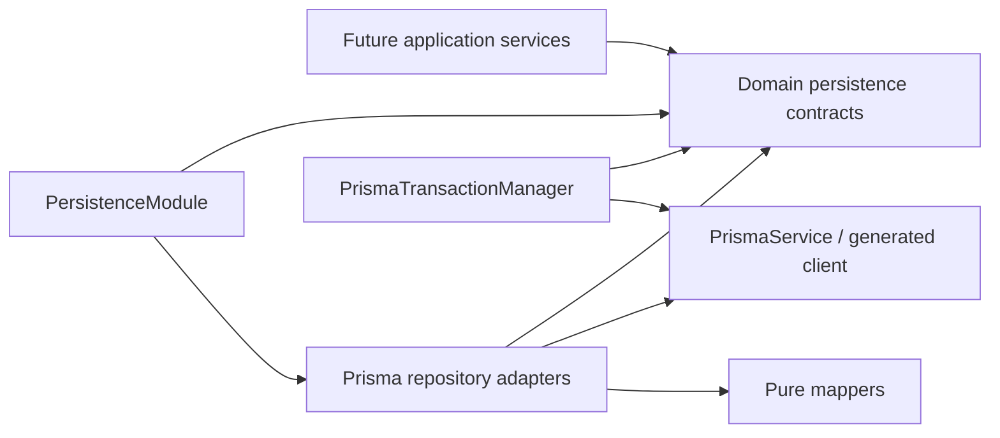

# Persistence Layer Final Review

## Review status

| Item                          | Result                                                        |
| ----------------------------- | ------------------------------------------------------------- |
| Review                        | Sprint 2.23 persistence final review and governance readiness |
| Date                          | 2026-07-20                                                    |
| Gate                          | `PASS WITH RESTRICTIONS`                                      |
| Foundation                    | PostgreSQL 16.13; frozen five-table baseline                  |
| Schema drift                  | None                                                          |
| Application data              | Empty                                                         |
| Source changes in this review | None                                                          |

The implemented persistence foundation is suitable for the explicitly listed read and controlled mutation application services. Governed Topic hierarchy mutation is not ready and remains blocked. This review does not authorize an API, controller, authentication or authorization implementation, seed execution, another migration, Flutter work, or deployment.

## Executive outcome

All five approved repository adapters, all five mappers, the transaction manager, and all six dependency-injection tokens form a coherent persistence boundary. Reads are deterministic, writes that require atomicity reject absent or invalid transaction contexts, optimistic concurrency is explicit, taxonomy audit rows are immutable, and integration evidence exercises rollback and concurrent races against disposable PostgreSQL databases.

No data-corruption defect was found. No persistence source was changed. The principal remaining design gap is deliberately isolated: an ordinary Topic change cannot alter `category_id` or `parent_topic_id`, while no governed hierarchy command contract yet exists. The separate [Governed Topic Hierarchy Command](../04-architecture/governed-topic-hierarchy-command.md) defines the proposal and unresolved approvals without granting implementation authority.

## Scope and evidence

The review covered the frozen schema and migration, the live development catalogue, domain persistence types and contracts, Prisma adapters and mappers, dependency injection, transaction ownership, unit and disposable-database integration tests, repository review records, database architecture, ADRs, and current roadmap/governance documents.

The review did not assess a non-existent application service, controller, public API, authentication system, seed runner, or Flutter consumer as implemented software.

## Reviewed sources

- `AGENTS.md`, root/documentation indexes, Product Decision Log, and Master Roadmap;
- Persistence, backend, database, and first-physical-schema architecture;
- Foundation Baseline and all five repository review records;
- Sprint 2 Persistence Implementation Decisions;
- `schema.prisma`, the applied initial migration, and Prisma configuration;
- every domain persistence contract and persistence-neutral type;
- every Prisma repository adapter, mapper, transaction/client resolver, safe error, token, and module provider;
- all persistence unit, module, integration, concurrency, rollback, and end-to-end tests; and
- the live PostgreSQL migration history, catalogue, constraints, indexes, collations, and row counts.

## Physical database verification

The authoritative live target is PostgreSQL 16.13 on the documented Docker development service. The catalogue contains only the approved application tables:

1. `actor_principals`
2. `languages`
3. `categories`
4. `topics`
5. `taxonomy_change_records`

The Prisma migration history contains one successful foundation migration. The application tables remain empty. Catalogue checks verify the approved enum, primary keys, foreign keys, unique constraints, check constraints, partial indexes, explicit `C` collations, and absence of application triggers, routines, generated columns, JSONB columns, and cascading foreign keys. Prisma reports no pending migration and schema-to-database diff reports no drift.

## Foundation integrity

| Artifact                                 | SHA-256                                                            |
| ---------------------------------------- | ------------------------------------------------------------------ |
| `services/core-api/prisma/schema.prisma` | `0C503B9B77346F0114093C47CF5E6C513749620465AF545165F1513DBE569113` |
| Initial `migration.sql`                  | `ACF58378B548F4677AABFB65260DA6E19C6D617B5162AC2BF444149E36FF837D` |

These values match the frozen [Foundation Baseline](./FOUNDATION-BASELINE.md). Sprint 2.23 introduces no schema or migration amendment.

## Dependency direction



Domain contracts do not import Prisma types. Adapters depend inward on contracts and use generated Prisma types only in infrastructure. Future application services must inject tokens/contracts rather than concrete adapters or `PrismaService`.

## Provider graph

| Token                               | Provider                               | Exported | Result |
| ----------------------------------- | -------------------------------------- | -------- | ------ |
| `TRANSACTION_MANAGER`               | `PrismaTransactionManager`             | Yes      | PASS   |
| `LANGUAGE_REPOSITORY`               | `PrismaLanguageRepository`             | Yes      | PASS   |
| `ACTOR_PRINCIPAL_REPOSITORY`        | `PrismaActorPrincipalRepository`       | Yes      | PASS   |
| `CATEGORY_REPOSITORY`               | `PrismaCategoryRepository`             | Yes      | PASS   |
| `TOPIC_REPOSITORY`                  | `PrismaTopicRepository`                | Yes      | PASS   |
| `TAXONOMY_CHANGE_RECORD_REPOSITORY` | `PrismaTaxonomyChangeRecordRepository` | Yes      | PASS   |

The module test proves token resolution. No global module or direct Prisma escape hatch is granted to application code.

## Contract inventory

| Contract and method                       | Semantics                              | Transaction / concurrency                                          | Verdict                |
| ----------------------------------------- | -------------------------------------- | ------------------------------------------------------------------ | ---------------------- |
| `LanguageRepository.findById`             | Optional read by identity              | Root or supplied valid context                                     | PASS                   |
| `findByNormalizedTag`                     | Optional exact normalized-tag read     | Database `C` collation                                             | PASS                   |
| `listContentEnabled`                      | Deterministic enabled list             | Read only                                                          | PASS                   |
| `listGovernanceManaged`                   | Deterministic governance list          | Read only                                                          | PASS                   |
| `ActorPrincipalRepository.findById`       | Optional read                          | Root or context                                                    | PASS                   |
| `existsById`                              | Boolean existence read                 | Root or context                                                    | PASS                   |
| `provisionControlled`                     | Idempotent same-ID/same-kind provision | Transaction required; conflict is safe                             | PASS WITH RESTRICTIONS |
| `CategoryRepository.findById`             | Optional read                          | Root or context                                                    | PASS                   |
| `findActiveByNormalizedName`              | Optional active-name read              | Partial uniqueness in PostgreSQL                                   | PASS                   |
| `listByLifecycle`                         | Deterministic lifecycle list           | Read only                                                          | PASS                   |
| `persistVersionedChange`                  | Ordinary non-hierarchy update          | Transaction required; expected lock and hierarchy versions         | PASS WITH RESTRICTIONS |
| `TopicRepository.findById`                | Optional read                          | Root or context                                                    | PASS                   |
| `findActiveByScopedName`                  | Active name scoped to Category/parent  | Partial uniqueness in PostgreSQL                                   | PASS                   |
| `listRootsByCategory`                     | Deterministic root list                | Read only                                                          | PASS                   |
| `listChildren`                            | Deterministic child list               | Read only                                                          | PASS                   |
| `loadHierarchy`                           | Deterministic flat Category hierarchy  | Effective visibility is an application concern                     | PASS WITH LIMITATIONS  |
| `persistVersionedChange`                  | Ordinary Topic update only             | Transaction required; expected lock; relationship changes rejected | PASS WITH RESTRICTIONS |
| `TaxonomyChangeRecordRepository.findById` | Optional audit read                    | Root or context                                                    | PASS                   |
| `findByCommandId`                         | Optional idempotency-key lookup        | Root or context                                                    | PASS                   |
| `append`                                  | Immutable audit append                 | Transaction required; strict uniqueness                            | PASS WITH RESTRICTIONS |
| `listForCategory`                         | Deterministic Category audit list      | Read only                                                          | PASS                   |
| `listForTopic`                            | Deterministic Topic audit list         | Read only                                                          | PASS                   |
| `findTerminalCorrection`                  | Bounded successor traversal            | Read only; malformed/overlong chains fail closed                   | PASS                   |
| `appendCorrection`                        | Immutable linear correction append     | Transaction required; expected terminal; one successor             | PASS WITH RESTRICTIONS |
| `TransactionManager.execute`              | Application-owned atomic boundary      | Read committed; opaque branded context; no nesting/reuse           | PASS                   |

Nullable reads consistently return `null`; list reads return arrays. Mappers return frozen records and copied `Date` values. Contracts expose no generated Prisma model.

### Persistence-neutral type inventory

| Kind                 | Types                                                                                                                                                                                       |
| -------------------- | ------------------------------------------------------------------------------------------------------------------------------------------------------------------------------------------- |
| Scalar/closed values | `EntityId`, `ExpectedVersion`, `TaxonomyLifecycleState`, `ActorPrincipalKind`                                                                                                               |
| Context and work     | `TransactionContext`, `TransactionWork<TResult>`, `RepositoryOperationContext`, `TransactionalRepositoryOperationContext`                                                                   |
| Records              | `LanguageRecord`, `ActorPrincipalRecord`, `CategoryRecord`, `TopicRecord`, `TaxonomyChangeRecordView`                                                                                       |
| Inputs/scopes        | `ProvisionActorPrincipalInput`, `PersistCategoryChangeInput`, `TopicNameScope`, `PersistTopicChangeInput`, `AppendTaxonomyChangeRecordInput`, `AppendTaxonomyCorrectionInput`               |
| Results              | `VersionedMutationResult<TEntity>`, `CategoryMutationResult`                                                                                                                                |
| Errors               | `PersistenceError`, `RepositoryUnavailableError`, `EntityNotFoundError`, `DuplicateEntityError`, `OptimisticConcurrencyError`, `ConstraintViolationError`, `InvalidTransactionContextError` |
| Tokens               | `TRANSACTION_MANAGER` plus the five repository tokens                                                                                                                                       |

`EntityId` and `ExpectedVersion` are persistence-neutral aliases. The abstract private brand makes `TransactionContext` opaque. Optional `RepositoryOperationContext` selects the root client or a validated transaction client for reads; every mutation accepts the required transactional form.

### Exact method signatures

```text
TransactionManager.execute<TResult>(TransactionWork<TResult>) -> Promise<TResult>

LanguageRepository
  findById(EntityId, RepositoryOperationContext?) -> Promise<LanguageRecord | null>
  findByNormalizedTag(string, RepositoryOperationContext?) -> Promise<LanguageRecord | null>
  listContentEnabled(RepositoryOperationContext?) -> Promise<readonly LanguageRecord[]>
  listGovernanceManaged(RepositoryOperationContext?) -> Promise<readonly LanguageRecord[]>

ActorPrincipalRepository
  findById(EntityId, RepositoryOperationContext?) -> Promise<ActorPrincipalRecord | null>
  existsById(EntityId, RepositoryOperationContext?) -> Promise<boolean>
  provisionControlled(ProvisionActorPrincipalInput, TransactionalRepositoryOperationContext) -> Promise<ActorPrincipalRecord>

CategoryRepository
  findById(EntityId, RepositoryOperationContext?) -> Promise<CategoryRecord | null>
  findActiveByNormalizedName(string, RepositoryOperationContext?) -> Promise<CategoryRecord | null>
  listByLifecycle(TaxonomyLifecycleState, RepositoryOperationContext?) -> Promise<readonly CategoryRecord[]>
  persistVersionedChange(PersistCategoryChangeInput, TransactionalRepositoryOperationContext) -> Promise<CategoryMutationResult>

TopicRepository
  findById(EntityId, RepositoryOperationContext?) -> Promise<TopicRecord | null>
  findActiveByScopedName(TopicNameScope, RepositoryOperationContext?) -> Promise<TopicRecord | null>
  listRootsByCategory(EntityId, RepositoryOperationContext?) -> Promise<readonly TopicRecord[]>
  listChildren(EntityId, RepositoryOperationContext?) -> Promise<readonly TopicRecord[]>
  loadHierarchy(EntityId, RepositoryOperationContext?) -> Promise<readonly TopicRecord[]>
  persistVersionedChange(PersistTopicChangeInput, TransactionalRepositoryOperationContext) -> Promise<VersionedMutationResult<TopicRecord>>

TaxonomyChangeRecordRepository
  findById(EntityId, RepositoryOperationContext?) -> Promise<TaxonomyChangeRecordView | null>
  findByCommandId(EntityId, RepositoryOperationContext?) -> Promise<TaxonomyChangeRecordView | null>
  append(AppendTaxonomyChangeRecordInput, TransactionalRepositoryOperationContext) -> Promise<TaxonomyChangeRecordView>
  listForCategory(EntityId, RepositoryOperationContext?) -> Promise<readonly TaxonomyChangeRecordView[]>
  listForTopic(EntityId, RepositoryOperationContext?) -> Promise<readonly TaxonomyChangeRecordView[]>
  findTerminalCorrection(EntityId, RepositoryOperationContext?) -> Promise<TaxonomyChangeRecordView>
  appendCorrection(AppendTaxonomyCorrectionInput, TransactionalRepositoryOperationContext) -> Promise<TaxonomyChangeRecordView>
```

No redundant or governance-bypassing method was found. `findTerminalCorrection` deliberately throws for a missing or malformed chain rather than returning absence. The only naming/ownership improvement identified is the minor future audit append-input refinement recorded under Findings.

## Mapper review

| Mapper                 | Closed-value validation                  | Immutability                    | Date isolation | Result |
| ---------------------- | ---------------------------------------- | ------------------------------- | -------------- | ------ |
| Language               | Approved lifecycle/flags                 | Frozen                          | Copied         | PASS   |
| Actor Principal        | Approved actor kind                      | Frozen                          | Copied         | PASS   |
| Category               | Approved lifecycle                       | Frozen                          | Copied         | PASS   |
| Topic                  | Approved lifecycle                       | Frozen                          | Copied         | PASS   |
| Taxonomy Change Record | Target/action/reason/evidence validation | Deep-frozen evidence and record | Copied         | PASS   |

Invalid database values fail closed as persistence integrity failures; they are not silently coerced.

## Transaction model

`PrismaTransactionManager.execute` is the only approved application transaction entry point. It supplies an opaque context backed by Prisma's interactive transaction client at `ReadCommitted`. The AsyncLocalStorage guard rejects nested transactions. Repository context resolution rejects foreign, expired, or malformed contexts. Mutation adapters reject a missing context before issuing a write.

| Write                      | Required same-transaction collaborators       | Rollback evidence                                             | Result                  |
| -------------------------- | --------------------------------------------- | ------------------------------------------------------------- | ----------------------- |
| Controlled Actor provision | Actor repository                              | Tested                                                        | PASS                    |
| Ordinary Category change   | Category plus future audit append             | Repository rollback tested; orchestration not yet implemented | READY WITH RESTRICTIONS |
| Ordinary Topic change      | Topic plus future audit append                | Repository rollback tested; orchestration not yet implemented | READY WITH RESTRICTIONS |
| Audit append               | Calling governed service                      | Tested                                                        | PASS                    |
| Audit correction           | Audit repository                              | Tested                                                        | PASS                    |
| Topic hierarchy change     | Future hierarchy repository plus audit append | Design only                                                   | BLOCKED                 |

No repository starts its own transaction. That preserves application ownership of multi-repository atomicity.

## Rollback matrix

| Operation                  | Failure injected after repository success | Durable change after rollback        | Result |
| -------------------------- | ----------------------------------------- | ------------------------------------ | ------ |
| Actor Principal provision  | Caller throws                             | None                                 | PASS   |
| Category ordinary change   | Caller throws                             | None                                 | PASS   |
| Topic ordinary change      | Caller throws                             | None                                 | PASS   |
| Taxonomy audit append      | Caller throws                             | None                                 | PASS   |
| Taxonomy correction append | Constraint/concurrency failure            | No partial successor/original change | PASS   |

Read operations have no rollback requirement. The future hierarchy command must prove both relationship and audit rollback in one application-owned transaction.

## Concurrency review

| Invariant                       | Mechanism                                                  | Evidence                                     | Result  |
| ------------------------------- | ---------------------------------------------------------- | -------------------------------------------- | ------- |
| Actor ID/kind idempotency       | Unique identity plus compare-existing                      | Concurrent integration case                  | PASS    |
| Category ordinary update        | Conditional expected lock and hierarchy versions           | Lock/hierarchy/both conflict tests           | PASS    |
| Topic ordinary update           | Conditional expected lock and unchanged relationship scope | Concurrent winner and relationship rejection | PASS    |
| Audit command uniqueness        | Unique `command_id`                                        | One-winner race                              | PASS    |
| One direct correction successor | Unique predecessor relation                                | One-winner successor race                    | PASS    |
| Correction linearity            | Expected terminal plus predecessor/successor traversal     | Branch/cycle/terminal tests                  | PASS    |
| Governed Topic move             | Category and row lock protocol not implemented             | Design gap                                   | BLOCKED |

Recognized uniqueness and concurrency failures are mapped to stable safe errors. Arbitrary retries are not performed inside repositories.

## Error-safety review

The stable error vocabulary is `PERSISTENCE_ERROR`, `REPOSITORY_UNAVAILABLE`, `ENTITY_NOT_FOUND`, `DUPLICATE_ENTITY`, `OPTIMISTIC_CONCURRENCY`, `OPTIMISTIC_LOCK_CONCURRENCY`, `OPTIMISTIC_HIERARCHY_CONCURRENCY`, `OPTIMISTIC_LOCK_AND_HIERARCHY_CONCURRENCY`, `CONSTRAINT_VIOLATION`, and `INVALID_TRANSACTION_CONTEXT`.

Public messages do not expose SQL, table/column names, normalized taxonomy names, connection strings, evidence payloads, or driver diagnostics. Causes are retained in a private field and exposed only as `hasCause`. Future application error translation must preserve this boundary and must not serialize internal exceptions.

## Aggregate and invariant boundaries

| Aggregate / record     | Repository authority                                 | Explicit exclusion                                              |
| ---------------------- | ---------------------------------------------------- | --------------------------------------------------------------- |
| Language               | Read approved reference data                         | Mutation and seed execution                                     |
| Actor Principal        | Controlled identity provisioning                     | Authentication, authorization, profile/account lifecycle        |
| Category               | Ordinary versioned scalar/lifecycle change           | Hierarchy command coordination and automatic audit              |
| Topic                  | Reads and ordinary versioned non-relationship change | Reparenting, cross-Category move, cycle handling                |
| Taxonomy Change Record | Immutable append and correction chain                | Updating/deleting history or authorizing the underlying command |

Database checks remain the last line of defence for lengths, normalized forms, lifecycle-compatible fields, target/action shape, correction chronology, and relationship integrity. Application services must validate user intent and authorization before calling persistence.

## Database-invariant matrix

| Invariant family    | Database control                                                    | Repository responsibility                       | Result                      |
| ------------------- | ------------------------------------------------------------------- | ----------------------------------------------- | --------------------------- |
| Identity            | UUID primary keys and foreign keys                                  | Application-assigned IDs; safe missing handling | PASS                        |
| Lifecycle           | One approved enum plus lifecycle/archive checks                     | Closed-value mapping and coherent timestamps    | PASS                        |
| Normalization       | Length/shape checks, explicit `C` collation, unique/partial indexes | Supply already-normalized approved values       | PASS                        |
| Taxonomy names      | Active Category/root/sibling partial uniqueness                     | Exact-scope reads and duplicate translation     | PASS                        |
| Versioning          | Non-negative lock/hierarchy checks                                  | Conditional writes and exact increments         | PASS                        |
| Topic relationships | Restrictive same-schema foreign keys                                | Ordinary adapter rejects relationship changes   | PASS WITH HIERARCHY BLOCKED |
| Audit target/action | Target cardinality, operation applicability, reason/version checks  | Immutable append input and safe translation     | PASS                        |
| Correction chain    | Unique predecessor and restrictive self/foreign keys                | Expected terminal plus bounded chain validation | PASS                        |
| Historical safety   | All foreign keys non-cascading                                      | No update/delete audit methods                  | PASS                        |

## Language repository review

The adapter is correctly read-only, deterministic, null-safe, and independent of seed authority. The database collation and normalized-tag uniqueness support exact lookup. It is ready for internal read services; learner visibility and localization fallback remain service/product concerns.

## Actor Principal repository review

Controlled provisioning is idempotent only for the same approved identity and kind. A mismatch is a conflict, not an implicit identity mutation. The repository deliberately does not authenticate or authorize the actor. It is ready only for a trusted internal provisioning service with an approved caller and input source.

## Category repository review

Ordinary changes require both the expected Category lock and hierarchy versions and increment only the ordinary lock. Missing, lock-only, hierarchy-only, and combined conflicts are distinguished safely. The future application service must append the approved audit evidence in the same transaction. Hierarchy changes are outside this adapter.

## Topic repository review

Reads provide identity, scoped-name, root, children, and flat hierarchy access with deterministic ordering. Ordinary persistence increments the Topic lock and refuses a changed Category or parent even if a caller constructs such a record. This is the key enforcement that prevents the unresolved hierarchy workflow from being bypassed.

## Taxonomy Change Record repository review

Audit rows are append-only. Strict command uniqueness supports detection, while application-level equivalent-command replay semantics remain future orchestration work. Corrections form a bounded linear chain, must be later than their predecessor, require the expected terminal, and cannot create a second direct successor. No update or delete operation exists.

## Disposable-database safety

Each integration suite requires a dedicated URL whose database name carries its repository-specific disposable prefix. The suite refuses unsafe targets, applies the reviewed migration to the disposable database, exercises real PostgreSQL behavior, and relies on an outer `try/finally` harness to drop the database with forced connection termination. Post-run catalogue inspection must show zero matching disposable databases. This is suitable for the current governance workflow; a checked-in orchestration script is a future operability improvement, not a correctness blocker.

## Test coverage assessment

Unit coverage includes contracts, pure mappers, error behavior, client/context resolution, mutation constraints, rollback, module binding, and adapter failure translation. Integration coverage covers all five repositories on PostgreSQL, including Category and Topic optimistic concurrency, Actor idempotency, and audit uniqueness/correction races. The Core API end-to-end smoke test remains green.

The main absent test family is the intentionally unimplemented hierarchy command. Its required cases are listed in the hierarchy design and must precede authorization.

## Security and privacy assessment

- Actor identity is represented without implementing credentials or authentication.
- Audit evidence is treated as potentially sensitive and is not emitted in errors.
- Parameterized Prisma operations and the one approved bounded static lock query avoid interpolated SQL.
- Application authorization, actor-to-request binding, evidence minimization, and retention enforcement remain downstream gates.
- Repository contracts must not be exposed directly as public request DTOs.

## Performance and operability assessment

Foundation reads are indexed and deterministic. Correction traversal is bounded at 1,000 records, preventing unbounded work but remaining linear; monitor chain depth before broad audit volume. Hierarchy loads and audit lists are currently unpaginated internal operations and must not become unrestricted public endpoints. Repository error classification is repeated across several adapters; centralization may reduce future drift but is not required to correct current behavior.

## Governed Topic hierarchy gap

Ordinary Topic persistence cannot safely implement a move because the command needs Category hierarchy concurrency, target-parent validation and locking, cycle prevention, sibling ordering, and atomic audit evidence. Option B, a separate `TaxonomyHierarchyRepository`, is recommended. It best preserves the Topic repository's ordinary-change boundary and gives the future application service one explicit hierarchy primitive inside the shared transaction.

Option A, extending `TopicRepository`, obscures the aggregate-level protocol. Option C, an infrastructure coordinator that also appends audit, would move workflow ownership out of the application layer. Option D, coordinating current methods, cannot lock or mutate the required relationship fields and is unsafe.

The detailed design is [Governed Topic Hierarchy Command](../04-architecture/governed-topic-hierarchy-command.md). Parent-row locking, archived-parent policy, and retry/idempotency semantics require approval. Therefore hierarchy mutation remains `BLOCKED`.

## Recommended future hierarchy contract

Approve a new `TaxonomyHierarchyRepository` with one narrow same-Category move primitive. A future application service must own the `TransactionManager.execute` boundary, call the hierarchy primitive, construct authoritative before/after audit evidence, and append it through `TaxonomyChangeRecordRepository` before commit. The proposed input, result, errors, lock order, cycle checks, version increments, audit requirements, and disposable test matrix are specified in the hierarchy design. No current contract should be widened until the three unresolved policies are approved.

## Application-service readiness matrix

| Candidate application service    | Status                           | Conditions                                                             |
| -------------------------------- | -------------------------------- | ---------------------------------------------------------------------- |
| `ListLanguages`                  | `IMPLEMENTED IN SPRINT 2.24`     | Read-only content-enabled Language query; no transport exposure        |
| `GetCategory`                    | `IMPLEMENTED IN SPRINT 2.25`     | Read-only ID/active-name queries; no transport exposure                |
| `ListCategories`                 | `IMPLEMENTED IN SPRINT 2.25`     | Read-only lifecycle list; public visibility/pagination deferred        |
| `GetTopic`                       | `READY WITH LIMITATIONS`         | Effective ancestor/category visibility belongs to service              |
| `ListTopicHierarchy`             | `READY WITH LIMITATIONS`         | Flat read only; bound result and filter effective visibility           |
| `ProvisionActorPrincipal`        | `IMPLEMENTED IN SPRINT 2.27`     | Internal application service only; no authentication claim             |
| `PersistCategoryChange`          | `IMPLEMENTED INTERNAL PRIMITIVE` | Sprint 2.28; caller authorization and audit orchestration remain gated |
| `PersistTopicOrdinaryChange`     | `IMPLEMENTED; RECHECK PENDING`   | Final corrected disposable concurrency rerun remains outstanding       |
| `AppendTaxonomyChange`           | `READY WITH RESTRICTIONS`        | Trusted governed command; validated/minimized evidence                 |
| `CorrectTaxonomyChange`          | `READY WITH RESTRICTIONS`        | Authorized correction reason and expected terminal                     |
| `GovernedTopicHierarchyMutation` | `BLOCKED`                        | Approve and implement the separate command/repository design           |

This matrix grants implementation authority for future, separately scoped tasks limited to the listed conditions. It does not authorize combining multiple major services in one increment or crossing into transport, authentication, seed, schema, migration, or Flutter work.

## Findings

### Major

1. **Hierarchy command incomplete and isolated.** Parent locking, cycle protocol, archived-parent behavior, retry/idempotency semantics, and aggregate audit coordination are not approved or implemented. Impact is limited because the Topic adapter rejects relationship changes. Resolution: keep hierarchy services blocked and review the proposed design.

### Minor

1. **Audit append input shape includes persistence-owned output fields.** The current record-shaped contract is tested and safe, but a future dedicated append command type could clarify ownership of `createdAt` and generated values.
2. **Failure classification is repeated.** Category, Topic, and audit adapters contain similar Prisma error translation. Current behavior is consistent; consider a small shared classifier only when another adapter makes the duplication material.
3. **Disposable orchestration is external.** Tests have strong database-name guards, but the create/migrate/drop harness is not a single checked-in command. Add one before CI parallelization.

### Observations

1. Correction-chain traversal is intentionally bounded and linear.
2. Flat hierarchy and audit list operations need application-level bounds before public API use.
3. No seed data exists, so read services will correctly return empty results in the current development database.

No blocker affects the approved non-hierarchy service candidates.

## Resolved findings

- All five adapters exist and all six tokens resolve.
- Domain contracts are Prisma-independent.
- Mutation contexts fail closed.
- Category dual-version and Topic ordinary-version concurrency are enforced.
- Topic relationship mutation cannot bypass governance.
- Audit append/correction is immutable and race-tested.
- Safe errors protect database and evidence details.
- The frozen baseline remains empty and drift-free.

## Unresolved findings

- **MAJOR:** governed hierarchy parent-locking, archived-parent, and retry/idempotency policies remain unapproved. This is isolated by the Topic relationship-change guard and blocks only hierarchy mutation.
- **MINOR:** a dedicated audit append command type would make persistence-owned output fields clearer.
- **MINOR:** repeated adapter error classification and external disposable orchestration are maintainability/operability improvements, not current safety failures.
- **OBSERVATION:** correction traversal and unpaginated internal lists require monitoring/bounds before larger workloads or API exposure.

## Deferred and prohibited work

The following remain unauthorized: governed hierarchy implementation; application services outside the readiness matrix; controllers and APIs; authentication and authorization; seed execution; schema or migration changes; database writes outside disposable tests; repository expansion; Flutter work; and staging/production deployment.

## Downstream authorization recommendation

Sprint 2.24 through Sprint 2.26 implemented taxonomy queries, Sprint 2.27 implemented [Actor Principal provisioning](./ACTOR-PROVISIONING-SERVICE-REVIEW.md), Sprint 2.28 implemented [Category ordinary mutation](./CATEGORY-MUTATION-SERVICE-REVIEW.md), and Sprint 2.29 implements the narrow internal [Topic ordinary mutation primitive](./TOPIC-MUTATION-SERVICE-REVIEW.md). The Topic command and repository input exclude Category, parent, display order, and hierarchy instructions. Any governed product workflow still requires caller authorization and explicit audit orchestration. Hierarchy work remains separately blocked.

## Final gate decision

`PASS WITH RESTRICTIONS`

This gate authorizes future, separately scoped implementation of the readiness-matrix read services, controlled Actor Principal provisioning, ordinary Category and Topic changes, and immutable audit append/correction. Sprint 2.23 implements none of them. Governed Topic hierarchy mutation is excluded and blocked.

## Validation record

The completion run covers formatting, lint, TypeScript compilation, build, unit tests, end-to-end tests, all five disposable PostgreSQL integration suites, Prisma validate/generate/migrate status, schema-to-database diff, live catalogue inspection, checksum verification, Markdown formatting, internal links, headings, stale status, prohibited imports, diff whitespace, documentation-only scope, and staged-file state. Exact command outcomes are reported with the Sprint 2.23 completion response.
